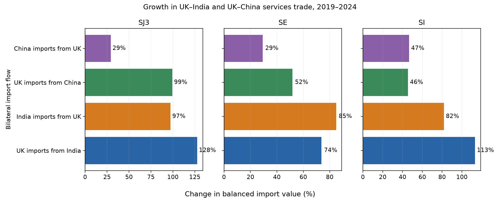

# 生成式 AI 冲击下的土木工程行业经济：英国与印度、中国的服务关系

柴宇轩

斯特拉斯克莱德大学，格拉斯哥，英国

通讯作者：柴宇轩，斯特拉斯克莱德大学。邮箱：yuxuanchai98@outlook.com

本稿与英文稿同时投送 *International Journal of Construction Management*。图表编号、系数与英文稿一致。

## 摘要

本文以英国为共同节点，比较英国—印度与英国—中国两组服务关系，并将双边趋势放入欧洲企业自然语言生成（NLG）AI 采用冲击中解释。双边证据覆盖技术及其他商业服务（SJ3）、建筑服务（SE）和计算机信息服务（SI）。17 个欧盟进口国提供统一的企业 NLG 采用度。英国趋势是描述性的；面板检验进口国采用是否与印度模式一服务或中国项目型建筑服务相关。冲击为 Eurostat 专业服务企业 NLG 使用率在 2023—2024 年的变化。国内结果为 NACE M71 建筑与工程活动的营业额、就业、工资和增加值；贸易结果来自 OECD–WTO BaTIS。2019—2024 年，英国自印度进口 SJ3 增长 127.7%，自中国进口 SJ3 增长 99.3%。进口国面板中，印度 SJ3 系数为 0.021（标准误 0.008），中国建筑服务与进口国 NLG 采用无关（−0.008，0.009）。高采用国的 M71 营业额与工资增长较慢，就业不变。证据与生成式工具改变可数字交付服务协调相一致，尤其是英国—印度关系；但不能证明 AI 导致双边变化，也不能证明土木工程岗位或 GDP 发生转移。

**关键词：** 生成式 AI；土木工程；工程管理；服务贸易；NACE M71；模式一

## 1. 引言

土木工程同时包含可数字传输的知识任务和必须在现场完成的项目任务。图纸、规范、计算与报告可以跨境交付；现场检查、法定责任和道路、桥梁或供水系统的施工仍依赖地点。生成式 AI 因此可能通过两条渠道影响土木工程行业经济：改变建筑与工程咨询公司内部的工作成本，以及改变技术任务的跨境协调成本。

英国与印度、中国的服务联系使这一区分可观察。英国—印度贸易在现有数据中更偏向远程商业与计算机服务；英国—中国贸易在 SJ3 与计算机服务之外，还包含大于英国—印度的建筑服务流量。比较相同服务类别和贸易方向，比把两个伙伴当作孤立案例更有信息量。

研究问题分为两层。第一，生成式 AI 时期英国与印度、中国的技术、建筑和计算机服务关系如何变化？第二，统一的欧盟证据是否显示进口国 NLG 采用与国内建筑工程活动、印度 SJ3 进口和中国建筑服务相关？这不是国家 AI 战略比较。它把描述性的英国双边变化，与具有共同处理变量的面板设定分开。

三项测量选择随之确定。第一，冲击必须捕捉生成式使用，而不是一般数字成熟度。Eurostat 的 E_AI_TNLG 记录企业是否使用 AI 生成书面或口头语言。第二，国内行业是 NACE M71 建筑与工程活动，不是 NACE F 建筑业。第三，双边部分同时报告英国—印度和英国—中国两个方向的 SJ3、SE 和 SI。面板随后以印度 SJ3 作为可数字交付结果，以中国 SE 作为项目交付对照。

## 2. 文献与机制

Autor, Levy and Murnane (2003) 将经验工作从职业转向任务。Autor (2015) 强调自动化可能提高互补性非例行工作的价值，Acemoglu and Restrepo (2018, 2019, 2020) 则区分替代与新任务创造。应用于土木工程，这一框架预测不均衡反应：绘图、文件准备和常规计算更易接受软件辅助，现场监督、责任判断和法定签章则不然。

任务生产率不能机械映射为行业增长。咨询公司若以更少小时完成一套图纸，可能承接更多项目、减少计费小时、降低价格或改变人员结构。因此营业额可能放缓，即使实物生产率上升。下文使用的 M71 账户之所以重要，正是因为它观察行业结果，而不是从职业暴露度推断。

Felten, Raj and Seamans (2018, 2021)、Webb (2020) 和 Eloundou et al. (2023, 2024) 构造职业暴露的事前指标。此类指标描述任务内容，但不是采用观察。本文因此使用已实现的采用率。Noy and Zhang (2023)、Peng et al. (2023)、Brynjolfsson, Li and Raymond (2025)、Dell’Acqua et al. (2023) 和 Hui, Reshef and Zhou (2024) 表明，生成式工具提高部分知识任务效率，但存在明显的任务边界。Agrawal, Gans and Goldfarb (2018, 2022) 将 AI 理解为更便宜的预测；Korinek and Stiglitz (2021) 提醒收益分配取决于自动化还是增强。

任务贸易理论指出，可通过网络传输的活动更容易跨境（Blinder 2006；Grossman and Rossi-Hansberg 2008；Baldwin 2016, 2019）。GATS（WTO 1994）仍将供应分为模式一至模式四。Francois and Hoekman (2010) 与 Loungani et al. (2017) 回顾了服务贸易数据滞后于货物贸易的原因。对土木工程而言，图纸和计算更接近模式一；中国企业供应的施工更可能需要项目现场存在。OECD–WTO BaTIS（Fortanier et al. 2017）提供可比较的双边 EBOPS 类别。持续可得的最细专业类别是 SJ3；双边 SJ312 建筑与工程服务不可得，因此印度 SJ3 应视为宽口径上界。

建筑经济学长期把承包商行业视为项目型、本地且数字化较弱（Gann and Salter 2000；Winch 2010）。建筑信息模型（Eastman et al. 2011；Sacks et al. 2018）数字化的是设计与协调，主要位于 NACE M71 及相关咨询机构，而不必然位于 NACE F。Whyte (2019) 同样把数字交付定位于专业组织而非仅施工现场。Eurostat (2024) 证实专业服务企业的 NLG 采用远快于建筑企业（表 2、图 3）。

## 3. 数据

分析只使用已检索的官方序列（Eurostat 2024；OECD & WTO n.d.；ILO n.d.）。不对国家、行业或贸易单元格插值。

英国是两组比较的共同国家。英国—印度对应成熟的远程专业服务关系；英国—中国提供同时观察技术、计算机和建筑服务的对照。英国不在本文采用的统一 Eurostat 企业 NLG 面板内，因此双边数值报告为趋势。欧盟面板因具有共同处理变量而承担推断。

首选冲击为 NACE M 的 ΔTNLG，2024 年减 2023 年。欧盟 27 国专业服务 NLG 使用率为 4.55%（2023）、11.51%（2024）和 17.74%（2025）；建筑业同期为 0.58%、2.42% 和 3.25%（表 2）。NACE M71 的 AI 采用率未公布，NACE M 是包含 M71 企业的最细单元格。

行业结果来自 Eurostat 结构性商业统计 2021—2024 年的 M71 营业额、就业、工资和增加值。ILOSTAT 提供 ISIC F 与 M 就业（ILO n.d.），中国在此次提取中为空，ISIC M71 未公布。

OECD & WTO (n.d.) BaTIS 调整 B 提供 2015—2024 年当期美元百万的双边值（Fortanier et al. 2017）。走廊文件含 120 个观测：四个有方向的进口流、三个服务类别和十年。面板的主要结果仍是自印度进口的 SJ3；中国 SE 为项目交付对照（表 1）。

## 4. 方法

双边部分报告水平值、2019—2024 年变化率和以 2019 年为 100 的指数。它不使用处理方程，因为三国缺少可比的企业 NLG 冲击。

欧盟进口国 \(i\) 的印度设定为：

\[
\log M^{SJ3,IND}_{it}=\alpha_i+\delta_t+\beta\bigl(\mathbf{1}[t\ge t_0]\times \Delta TNLG_i\bigr)+\varepsilon_{it}.
\]

标准误按进口国聚类。印度样本为 119 个进口国—年观测；合并模式一稳健性模型含 357 个观测。国内 M71 模型为：

\[
\log Y^{M71}_{it}=\alpha_i+\delta_t+\beta\bigl(\mathbf{1}[t\ge 2024]\times \Delta TNLG_i\bigr)+u_{it},
\]

\(Y\) 为营业额、就业、工资、增加值等，\(N=68\)。两种设计都不识别双边土木工程师就业、企业分包或 GDP 效应。表 6 概括这一主张边界。

## 5. 结果

### 5.1 英国—中国（图 1–2，表 1）

英国自中国进口 SJ3 从 2019 年的 7.755 亿美元升至 2024 年的 15.460 亿美元，增长 99.3%；中国自英国进口从 7.390 亿升至 9.546 亿美元，增长 29.2%。计算机信息服务两个方向分别增长 45.5% 和 46.7%。建筑服务分别增长 51.7% 和 29.2%，但绝对规模远小于 SJ3 和 SI。英国—中国关系不能用单一“建筑服务”概括。

### 5.2 英国—印度（图 1–2，表 1）

英国自印度进口 SJ3 从 21.866 亿美元升至 49.793 亿美元，增长 127.7%；印度自英国进口从 7.876 亿美元升至 15.542 亿美元，增长 97.3%。英国自印度进口 SI 增长 113.2%，反向增长 81.8%。建筑服务增长率也较高，但 2019 年基数仅约 4,000 万美元，不能把其百分比与数十亿美元的 SJ3 和 SI 等量解释。这些是描述性变化，不是因果识别：英国不在统一 NLG 面板内。

### 5.3 笼统“任何 AI”不是正确冲击（表 3）

16 国样本中，NACE M“任何 AI”变化与对数 SJ3 进口的冲击后交互为 0.000（标准误 0.006，\(N=336\)）。较小八个国家样本中的正估计在扩大覆盖后消失。这解释了为何主成分不使用宽口径数字成熟度指数（表 3）。

### 5.4 首选冲击与印度 SJ3（图 3–4，表 2–3）

专业服务 NLG 使用率在 2023—2024 年显著上升，且成员国之间差异很大（图 3、表 2）。合并模式一面板中，2024 年交互为 0.007（0.003）；仅印度时升至 0.021（0.008）。2022—2024 年印度 SJ3 进口变化的截面关系同样为正（图 4）。计算机服务、中国 SJ3、中国建筑服务、研发和咨询不复制这一关联（表 3）。

### 5.5 国内 M71 行业（图 5，表 4）

2021—2024 年几乎所有成员国的名义 M71 营业额都在上升（图 5）。固定效应模型问的是高 NLG 采用国是否增长得不同。对数 M71 营业额估计为 −0.007（0.003，\(N=68\)），工资为 −0.009，增加值为 −0.006，就业接近零（表 4）。建筑业营业额为 −0.010，因此结果并非 M71 独有。

### 5.6 进口国面板中的印度与中国（表 3、表 5）

印度 SJ3 的冲击后系数为 0.021（0.008），中国建筑服务为 −0.008（0.009），中国 SJ3 亦不显著（表 3）。按目的地采用分组，中国建筑服务对低 ΔTNLG 目的地在 2019—2024 年增长 65.4%，对高 ΔTNLG 目的地增长 47.5%（表 5）。项目型中国服务没有向 NLG 冲击更强的进口国重新配置。正系数属于欧盟市场上的印度 SJ3，不能机械转移到英国双边。

## 6. 讨论

服务类别和贸易方向不能省略。英国自印度进口 SJ3 在 2019—2024 年约增加 27.93 亿美元，自中国进口约增加 7.71 亿美元。相似的面板百分比系数意味着完全不同的金额。M71 就业稳定而营业额与工资增长较慢，可能与计费小时压缩、价格或需求构成有关，现有数据无法区分。印度正系数与跨境技术协调成本下降相一致，也可能反映与采用相关的需求或采购变化。表 6 把可支持的主张与未识别对象分开。

## 7. 局限

Eurostat 没有 M71 专属 NLG 采用率，NACE M 只是代理。SJ3 宽于建筑与工程服务，SJ312 不可得。印度、中国和英国缺少统一的企业 NLG 指标，双边分析是描述性的。BaTIS 为平衡估计，部分观测由编制机构调整或插补；本文没有自行插值。SBS 只有一个完整冲击后年份，且结果为当期价格。建筑业营业额同样为负，难以把工程咨询特有反应与更广泛的国内条件分开。

## 8. 结论

2019—2024 年，英国与印度、中国的服务关系都在扩大，但结构不同。英国自印度进口 SJ3 增长最显著；英国自中国进口 SJ3 也接近翻倍，金额明显较低。欧盟面板中，NLG 采用与印度 SJ3 正相关，与中国建筑服务无关；国内 M71 营业额和工资相对放缓，就业不变。这些结果支持“可数字交付服务边际发生变化”的有限解释，但不支持 AI 导致双边土木工程岗位转移或 GDP 变化（表 6）。

## 利益冲突声明

作者报告不存在潜在利益冲突。

## 数据可得性声明

支持本文发现的数据收录于配套复制包 `Data_Study4_IJCM/`。Eurostat、OECD–WTO BaTIS 和 ILOSTAT 序列仍受其出版方条款约束，引用方式见参考文献。作者生成文件以 CC BY 4.0 发布。

## 参考文献

Acemoglu, D., & Restrepo, P. (2018). The race between man and machine: Implications of technology for growth, factor shares, and employment. *American Economic Review, 108*(6), 1488–1542.

Acemoglu, D., & Restrepo, P. (2019). Automation and new tasks: How technology displaces and reinstates labor. *Journal of Economic Perspectives, 33*(2), 3–30.

Acemoglu, D., & Restrepo, P. (2020). Robots and jobs: Evidence from US labor markets. *Journal of Political Economy, 128*(6), 2188–2244.

Agrawal, A., Gans, J., & Goldfarb, A. (2018). *Prediction machines: The simple economics of artificial intelligence*. Harvard Business Review Press.

Agrawal, A., Gans, J., & Goldfarb, A. (2022). *Power and prediction: The disruptive economics of artificial intelligence*. Harvard Business Review Press.

Autor, D. H. (2015). Why are there still so many jobs? The history and future of workplace automation. *Journal of Economic Perspectives, 29*(3), 3–30.

Autor, D. H., Levy, F., & Murnane, R. J. (2003). The skill content of recent technological change: An empirical exploration. *Quarterly Journal of Economics, 118*(4), 1279–1333.

Baldwin, R. (2016). *The great convergence: Information technology and the new globalization*. Harvard University Press.

Baldwin, R. (2019). *The globotics upheaval: Globalization, robotics, and the future of work*. Oxford University Press.

Blinder, A. S. (2006). Offshoring: The next industrial revolution? *Foreign Affairs, 85*(2), 113–128.

Brynjolfsson, E., Li, D., & Raymond, L. (2025). Generative AI at work. *Quarterly Journal of Economics, 140*(2), 889–942.

Dell’Acqua, F., McFowland, E., Mollick, E., Lifshitz-Assaf, H., Kellogg, K. C., Rajendran, S., Krayer, L., Candelon, F., & Lakhani, K. R. (2023). Navigating the jagged technological frontier: Field experimental evidence of the effects of AI on knowledge worker productivity and quality (Harvard Business School Working Paper 24-013).

Eastman, C., Teicholz, P., Sacks, R., & Liston, K. (2011). *BIM handbook: A guide to building information modeling* (2nd ed.). Wiley.

Eloundou, T., Manning, S., Mishkin, P., & Rock, D. (2023). GPTs are GPTs: An early look at the labor market impact potential of large language models. arXiv:2303.10130.

Eloundou, T., Manning, S., Mishkin, P., & Rock, D. (2024). GPTs are GPTs: Labor market impact potential of LLMs. *Science, 384*(6702), 1306–1308.

Eurostat. (2024). *ICT usage in enterprises: Artificial intelligence (isoc_eb_ain2); national accounts (nama_10_a64); structural business statistics (sbs_ovw_act, sbs_sc_ovw)*. European Commission.

Felten, E., Raj, M., & Seamans, R. (2018). A method to link advances in artificial intelligence to occupational abilities. *AEA Papers and Proceedings, 108*, 54–57.

Felten, E., Raj, M., & Seamans, R. (2021). Occupational, industry, and geographic exposure to artificial intelligence: A novel dataset and its potential uses. *Strategic Management Journal, 42*(12), 2195–2217.

Fortanier, F., Liberatore, A., Maurer, A., & Pilgrim, G. (2017). *The OECD–WTO Balanced Trade in Services database*. OECD/WTO.

Francois, J., & Hoekman, B. (2010). Services trade and policy. *Journal of Economic Literature, 48*(3), 642–692.

Gann, D. M., & Salter, A. J. (2000). Innovation in project-based, service-enhanced firms: The construction of complex products and systems. *Research Policy, 29*(7–8), 955–972.

Grossman, G. M., & Rossi-Hansberg, E. (2008). Trading tasks: A simple theory of offshoring. *American Economic Review, 98*(5), 1978–1997.

Hui, X., Reshef, O., & Zhou, L. (2024). The short-term effects of generative artificial intelligence on employment: Evidence from an online labor market. *Organization Science*.

ILO. (n.d.). *ILOSTAT: Employment by sex and economic activity*. International Labour Organization.

Korinek, A., & Stiglitz, J. E. (2021). Artificial intelligence, globalization, and strategies for economic development (NBER Working Paper 28453).

Loungani, P., Mishra, S., Papageorgiou, C., & Wang, K. (2017). World trade in services: Evidence from a new dataset (IMF Working Paper 17/77).

Noy, S., & Zhang, W. (2023). Experimental evidence on the productivity effects of generative artificial intelligence. *Science, 381*(6654), 187–192.

OECD & WTO. (n.d.). *BaTIS: Balanced Trade in Services dataset* (BPM6, adjustment B).

Peng, S., Kalliamvakou, E., Cihon, P., & Demirer, M. (2023). The impact of AI on developer productivity: Evidence from GitHub Copilot. arXiv:2302.06590.

Sacks, R., Eastman, C., Lee, G., & Teicholz, P. (2018). *BIM handbook: A guide to building information modeling for owners, designers, engineers, contractors, and facility managers* (3rd ed.). Wiley.

Webb, M. (2020). *The impact of artificial intelligence on the labor market*. Stanford University.

Whyte, J. (2019). How digital information transforms project delivery models. *Project Management Journal, 50*(2), 177–194.

Winch, G. M. (2010). *Managing construction projects* (2nd ed.). Wiley-Blackwell.

WTO. (1994). *General Agreement on Trade in Services*. World Trade Organization.

## 表

**表 1.** 英国—印度与英国—中国服务走廊

| 进口方向 | 服务 | 2019（百万美元） | 2024（百万美元） | 变化 |
|---|---|---|---|---|
| 英国自印度进口 | SJ3 技术及其他商业服务 | 2,186.6 | 4,979.3 | 127.7% |
| 印度自英国进口 | SJ3 技术及其他商业服务 | 787.6 | 1,554.2 | 97.3% |
| 英国自中国进口 | SJ3 技术及其他商业服务 | 775.5 | 1,546.0 | 99.3% |
| 中国自英国进口 | SJ3 技术及其他商业服务 | 739.0 | 954.6 | 29.2% |
| 英国自印度进口 | SE 建筑服务 | 41.9 | 72.8 | 73.7% |
| 印度自英国进口 | SE 建筑服务 | 39.3 | 72.6 | 84.8% |
| 英国自中国进口 | SE 建筑服务 | 118.5 | 179.8 | 51.7% |
| 中国自英国进口 | SE 建筑服务 | 54.8 | 70.8 | 29.2% |
| 英国自印度进口 | SI 计算机信息服务 | 2,215.3 | 4,723.0 | 113.2% |
| 印度自英国进口 | SI 计算机信息服务 | 389.2 | 707.6 | 81.8% |
| 英国自中国进口 | SI 计算机信息服务 | 724.7 | 1,054.5 | 45.5% |
| 中国自英国进口 | SI 计算机信息服务 | 1,639.3 | 2,404.1 | 46.7% |

*注.* 来源：OECD–WTO BaTIS，调整 B。数值为当期美元百万的平衡进口。

**表 2.** 欧盟 27 国企业自然语言生成 AI 使用率

| 行业 | 2023 | 2024 | 2025 |
|---|---|---|---|
| NACE M 专业服务 | 4.55% | 11.51% | 17.74% |
| NACE F 建筑业 | 0.58% | 2.42% | 3.25% |

*注.* 来源：Eurostat isoc_eb_ain2，至少 10 人企业。

**表 3.** NLG 冲击下的贸易估计

| 结果/设定 | 系数（标准误） | N |
|---|---|---|
| 印度 SJ3，Post × ΔM TNLG | 0.021*** (0.008) | 119 |
| 合并模式一 SJ3，Post-2024 × ΔM TNLG | 0.007** (0.003) | 357 |
| 中国建筑服务（SE） | −0.008 (0.009) | 119 |
| 中国 SJ3 | 0.005 (0.010) | 119 |
| 印度计算机服务对照 | −0.002 (0.006) | 357 |
| 笼统任何 AI 对照 | 0.000 (0.006) | 336 |

*注.* 进口国和年份固定效应；标准误按进口国聚类。合并模型还包含伙伴固定效应。*p < 0.10，**p < 0.05，***p < 0.01。

**表 4.** NLG 冲击下的 M71 行业结果

| 结果 | Post-2024 × ΔTNLG（标准误） | N |
|---|---|---|
| 对数 M71 营业额 | −0.007** (0.003) | 68 |
| 对数 M71 就业 | −0.000 (0.002) | 68 |
| 对数 M71 工资 | −0.009*** (0.003) | 68 |
| 对数 M71 增加值 | −0.006*** (0.002) | 68 |
| 对数建筑业营业额（对照） | −0.010*** (0.003) | 68 |

*注.* 国家和年份固定效应；标准误按国家聚类。*p < 0.10，**p < 0.05，***p < 0.01。

**表 5.** 按进口国 NLG 分组的中国建筑服务

| 欧盟目的地组 | 2019（百万美元） | 2024（百万美元） | 变化 |
|---|---|---|---|
| 较低 ΔTNLG | 571.9 | 946.2 | 65.4% |
| 较高 ΔTNLG | 679.9 | 1,002.6 | 47.5% |

*注.* 来源：OECD–WTO BaTIS SE。按进口国 NACE M TNLG 变化中位数分组。

**表 6.** 解释边界

| 数据支持 | 未识别 |
|---|---|
| 英国—印度与英国—中国双向服务趋势 | AI 导致这些双边变化 |
| 欧盟进口国 NLG 与印度 SJ3 相关 | 土木专用 SJ312 发票 |
| 中国建筑服务对照为零 | 印度替代中国或英国土木工程师 |
| M71 结果与进口国 NLG 相关 | 双边就业或 GDP 效应 |

*注.* 本表重述主张边界，不是额外统计检验。

## 图注

**图 1.** 英国与印度、中国的 SJ3 服务走廊，2015—2024 年（2019 = 100）。

**图 2.** 英国—印度与英国—中国各类服务贸易增长，2019—2024 年。

**图 3.** 欧盟 27 国专业服务 NLG 采用及技术对照。

**图 4.** 进口国 ΔTNLG 与印度 SJ3 进口变化。

**图 5.** M71 与建筑业营业额增长，2021—2024 年。

## 图

