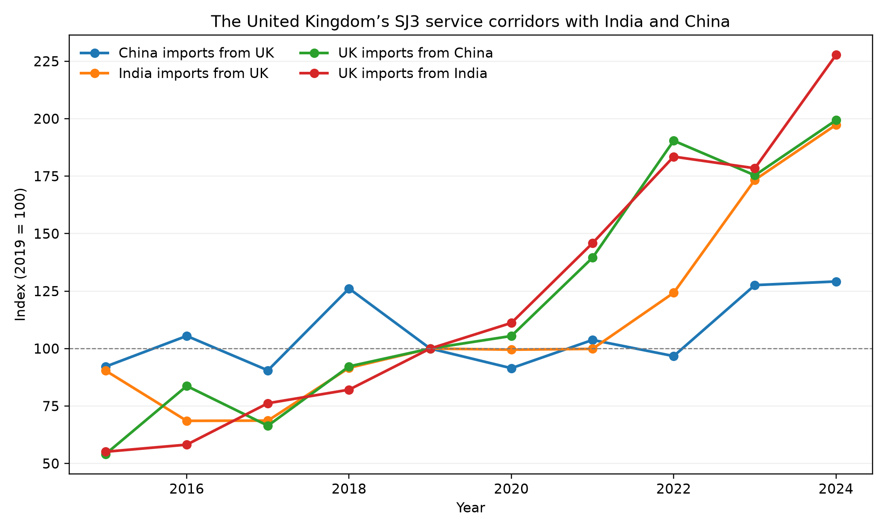

# How Does the Civil Engineering Industry Economy Change under an AI Shock? The United Kingdom’s Service Links with India and China

## Abstract

This paper studies the civil-engineering economy under a generative-AI shock through two United Kingdom-centred relationships: UK–India and UK–China. Bilateral evidence covers technical and other business services (SJ3), construction services (SE), and computer and information services (SI). A panel of 17 EU importers supplies harmonised variation in enterprise use of natural-language-generation (NLG) AI. UK trends are descriptive; the panel tests whether importer adoption is associated with Indian Mode-1 services or Chinese project-based construction services. The shock is the 2023–24 change in Eurostat NLG use among professional-service enterprises. Domestic outcomes are turnover, employment, wages and value added in NACE M71 architectural and engineering activities; trade outcomes come from OECD–WTO BaTIS. Between 2019 and 2024, UK imports of Indian SJ3 rose 127.7% and UK imports of Chinese SJ3 rose 99.3%. In the importer panel, the India-only SJ3 coefficient is 0.021 (s.e. 0.008), whereas Chinese construction services are unrelated to importer NLG adoption (−0.008, s.e. 0.009). Domestic M71 turnover and wages grew more slowly in higher-adoption economies, while employment was unchanged. The evidence is consistent with generative tools changing the coordination of digitally deliverable services, especially between the UK and India. It does not show that AI caused the bilateral changes or that civil-engineering jobs or GDP relocated.

**Keywords:** generative AI; civil engineering; construction management; services trade; NACE M71; Mode 1

## 1. Introduction

Civil engineering combines information-intensive design with physical delivery. Drawings, specifications, calculations and reports can be produced and transmitted digitally. Site inspection, statutory responsibility and the construction of roads, bridges or water systems remain tied to location. Generative AI may therefore affect the civil-engineering economy through more than one channel. It can change the cost of work inside architectural and engineering firms, and it can change the cost of coordinating technical tasks across borders.

The United Kingdom’s links with India and China make the distinction observable. UK–India trade is strongly oriented toward remotely supplied business and computer services in the available data. UK–China trade contains SJ3 and computer services alongside a larger construction-services flow than UK–India. Comparing the same service headings and directions across the two relationships is more informative than treating each partner as an isolated case.

The research question has two parts. First, how did the UK’s technical, construction and computer-service relationships with India and China change during the generative-AI period? Second, does harmonised EU evidence show a relationship between importer NLG adoption, domestic architectural and engineering activity, Indian SJ3 imports and Chinese construction services? This is not a comparison of national AI strategies. It separates descriptive UK bilateral changes from the panel specification that has a common treatment measure.

Three measurement choices follow. First, the shock must capture generative use rather than digital maturity in general. Eurostat’s E_AI_TNLG records enterprise use of AI to generate written or spoken language. Second, the domestic industry is NACE M71 architectural and engineering activities, not NACE F construction. Third, the bilateral section reports SJ3, SE and SI in both directions for UK–India and UK–China. The panel then uses Indian SJ3 as the digitally deliverable outcome and Chinese SE as a project-based comparison.

This design connects three bodies of evidence that are usually separate. Task studies show that language models can reduce the time required for writing, coding and analysis. Industry accounts reveal whether those task-level gains translate into turnover, employment or wages. Trade data show whether digitally deliverable services respond differently from project-based construction services. The contribution is not a new exposure index or a claim about aggregate GDP. It is a mode-specific comparison of domestic M71 outcomes and cross-border adjustment during the first observable generative-AI adoption wave.

A complete replication package accompanies this submission. Missing series are catalogued there; their absence is part of the claim boundary.

---

## 2. Literature review

### 2.1 Tasks, firms and industry outcomes

Autor, Levy and Murnane (2003) shifted empirical work from occupations to tasks. Autor (2015) emphasised that automation may raise the value of complementary non-routine work, while Acemoglu and Restrepo (2018, 2019, 2020) distinguish displacement from the creation of new tasks. Applied to civil engineering, this framework predicts an uneven response. Drafting, document preparation and routine calculation are more amenable to software assistance than site supervision, liability-bearing judgement and statutory sign-off.

Task productivity does not map mechanically into industry growth. If a consultancy completes a drawing package in fewer hours, it may deliver more projects, reduce billed hours, lower prices or change its staffing mix. Turnover can therefore slow even while physical productivity increases. The M71 accounts used below are valuable precisely because they observe the industry outcome rather than inferring it from occupational exposure.

### 2.2 Measuring the generative shock

Felten, Raj and Seamans (2018, 2021), Webb (2020) and Eloundou et al. (2023, 2024) construct prospective measures of occupational exposure. Such measures are useful for describing task content, but they are not observations of adoption. They also predate or blend several generations of technology. A country may have high potential exposure while few firms use generative tools, and a broad AI measure may rise because of systems unrelated to language production.

The preferred treatment is consequently a realised-adoption measure. Eurostat asks enterprises whether they use AI to generate written or spoken language. The 2023–24 change captures the period in which generative tools diffused rapidly through professional services and overlaps the final year of BaTIS and Structural Business Statistics. It remains imperfect because the survey reports NACE M rather than M71, but it is more closely aligned with the technology and timing of interest than a static occupation score or a consumer-user share.

### 2.3 Generative AI as a labour-market shock

The 2022–23 arrival of ChatGPT created a dated shock that earlier AI indices lack. Noy and Zhang (2023) find large productivity gains in professional writing. Peng, Kalliamvakou, Cihon and Demirer (2023) and related software studies find faster coding with Copilot. Brynjolfsson, Li and Raymond (2025) document customer-support productivity gains concentrated among less experienced workers. Dell’Acqua et al. (2023) describe a “jagged frontier”: AI helps some knowledge tasks and fails on others inside the same job. Hui, Reshef and Zhou (2024) study freelance coding after Copilot.

Two lessons matter for civil engineering. First, text and drawing tasks (specifications, CAD annotation, quantity take-off assistance) sit on the helped side of the jagged frontier; stamp, liability and site work sit on the other. Second, firm experiments are not industry accounts. A draughtsperson who finishes a drawing faster may reduce billed hours without reducing headcount, which is consistent with the SBS pattern in Section 5.5: wages and turnover grow more slowly where NLG jumped while employment does not.

Agrawal, Gans and Goldfarb (2018, 2022) frame AI as cheaper prediction. Korinek and Stiglitz (2021) warn that the distribution of gains depends on whether AI automates or augments. This paper does not estimate welfare. It asks which *measured* industry aggregates moved.

### 2.4 Tradable tasks and the UK’s partner relationships

Blinder (2006) argued that whatever can be delivered down a wire is potentially offshorable. Grossman and Rossi-Hansberg (2008) model trade in *tasks*. Baldwin (2016, 2019) emphasises globotics: digital technology unbundles the professional service from the office. GATS (WTO 1994) still classifies supply as Mode 1 (cross-border), Mode 2 (consumption abroad), Mode 3 (commercial presence) and Mode 4 (presence of natural persons). Francois and Hoekman (2010) and Loungani, Mishra, Papageorgiou and Wang (2017) review why services trade data lag goods data.

For civil engineering, the mode split is substantive rather than administrative. Drawings and calculations can be delivered from India without the supplier establishing a local office. Construction work supplied by Chinese firms is more likely to require a project presence, equipment, subcontractors and coordination on site. OECD–WTO BaTIS balanced statistics (Fortanier et al. 2017) provide bilateral EBOPS headings that allow these margins to be compared. The finest consistently available professional category is SJ3, technical, trade-related and other business services. Bilateral SJ312 architectural and engineering services are unavailable, so Indian SJ3 should be treated as a broad upper bound rather than a count of civil-engineering invoices.

Computer services (SI) are the natural digital comparison: if the panel result merely reflects all remote professional work, SI should move with TNLG; it does not (Table 3). Consulting (SJ2) and R&D (SJ1) provide additional checks in the supplementary tables.

### 2.5 Construction economics versus professional engineering

Construction economics has long treated the contractor industry as project-based, local and weakly digitised (Gann and Salter 2000; Winch 2010). Building information modelling (Eastman, Teicholz, Sacks and Liston 2011; Sacks, Eastman, Lee and Teicholz 2018) digitises *design and coordination*, which live in NACE M71 and related consultancies, not necessarily in NACE F. Whyte (2019) similarly locates digital delivery in professional organisations rather than only on the construction site.

Eurostat (2024) confirms the split. Professional-service enterprises adopted natural-language-generation tools much more rapidly than construction enterprises (Table 2, Figure 3). Felten et al. (2021) also report low industry AI-exposure scores for highway and heavy-civil contractors. On-site construction is therefore a comparison industry rather than the treated professional industry.

### 2.6 The empirical gap

Most research on AI and construction examines an occupation, a technology demonstration or a single project. Macro studies of AI and growth do not isolate engineering consultancies, while vacancy studies do not observe bilateral services delivery. Few studies ask whether a realised generative-adoption shock is associated simultaneously with M71 industry accounts and with different modes of engineering-related trade. The UK relationships with India and China address that gap without suggesting that the partners are otherwise comparable. Their role is to represent different service and delivery margins.

### 2.7 Why the two UK relationships are informative

The UK–India and UK–China relationships differ in ways that make a focused comparison useful. The UK–India relationship is strongly asymmetric in SJ3: the UK purchases far more from India than India purchases from the UK. This resembles a client economy sourcing remotely deliverable business services from India. The reverse flow is nevertheless sizeable and growing, which rules out a one-way account of trade. British firms also supply technical and professional inputs to Indian clients, even though BaTIS cannot identify the civil-engineering component separately.

The UK–China relationship has a different composition. UK imports of Chinese SJ3 almost doubled, but from a much smaller 2019 base than Indian SJ3. Chinese imports of UK SJ3 grew more slowly. Chinese construction services sold to the UK were larger than Indian construction services, while computer services remained important in the reverse direction. Reporting the three headings side by side prevents a rise in “services trade” from being mistaken for a civil-engineering response.

Neither pair is a natural experiment. Their institutions, languages, market sizes, trade policies and business cycles differ, and BaTIS values are balanced estimates that combine reported and imputed information. The comparison is used to organise observed evidence, not to claim that China is a control country for the UK. The inferential leverage comes from the EU panel, where the same adoption question and industrial classifications apply across importers.

This division between description and estimation is central to the paper. Bilateral trends answer where trade changed and in which service categories. The panel asks whether the change in importer NLG adoption predicts Indian SJ3 or Chinese construction imports after common importer and year differences are removed. Agreement between the two forms of evidence would strengthen a mechanism; disagreement would show why headline bilateral growth should not be attributed to AI.

---

## 3. Data

The analysis uses retrieved official series only (Eurostat 2024; OECD & WTO n.d.; ILO n.d.). No country, industry or trade cell is interpolated. Retrieval dates and unsuccessful pulls (including OWID ChatGPT files, an empty IMF AI Preparedness response, OECD ICT_BUS, and ILO M71) are documented in the supplementary replication package and are not filled.

### 3.1 Country-pair design

The United Kingdom is the common country in both comparisons. The UK–India pair captures a mature relationship in remotely supplied professional services. The UK–China pair provides a comparison in which technical, computer and construction services are also observed in both directions. Using the same BaTIS definitions and years avoids comparing unlike national sources.

The pair analysis does not assign an AI treatment to the UK, India or China. The UK is outside the harmonised Eurostat series used here, and consumer adoption measures are not equivalent to enterprise NLG use. Bilateral values are therefore reported as trends. The EU panel remains the inferential component because it supplies a common NLG measure across importers.

### 3.2 AI shock

Eurostat `isoc_eb_ain2`, enterprises with 10+ persons, percent using AI (Eurostat 2024):

- E_AI_TANY, NACE F and M: generic comparison (`eurostat_ai_raw.csv`).
- E_AI_TNLG, TML, TTM, TIR, TPVSG, NACE F and M: generative and technology placebos (`eurostat_ai_genai_types.csv`). TPVSG (pictures/video/sound) exists for **2025 only**.
- Same indicators, NACE C, J, N: sector placebos (`eurostat_ai_nace_placebos.csv`). NACE K (finance) is empty. **NACE M71 is not in the survey** (HTTP 400). NACE M is the finest cell that contains M71 firms.

**Preferred shock:** ΔTNLG in NACE M, 2024 minus 2023. EU-27 M: 2.60 (2021), 4.55 (2023), 11.51 (2024), 17.74 (2025). Construction: 0.99, 0.58, 2.42, 3.25.

### 3.3 Civil industry economy

- National accounts `nama_10_a64` / `_e`: GVA, employment, compensation (D1), output (P1) for M71, F, M. UK M71 GVA/D1 stop in **2018**.
- Structural business statistics `sbs_ovw_act` and `sbs_sc_ovw`: M71 vs F vs M, 2021–**2024**, net turnover, persons employed, wages, value added, GOS. This is the industry-economy file that overlaps the 2024 NLG year.
- ILOSTAT employment by sex and economic activity for ISIC F versus M (ILO n.d.). China is empty in this pull. ISIC M71 is not published (404).
- The US BLS series returned NAICS 54 rather than engineering-specific 54133 and is retained only in the supplementary data.

Values are **current prices** where applicable. Nominal growth is not a GenAI effect; the DiD asks whether high-NLG countries grew *faster*.

### 3.4 UK–India and UK–China trade outcomes

OECD & WTO (n.d.) BaTIS, adjustment B, supplies annual bilateral values in USD million from 2015 to 2024 (Fortanier et al. 2017). The corridor extract contains 120 observations: four directed import flows, three service headings and ten years. The four flows are UK imports from India, India imports from the UK, UK imports from China and China imports from the UK. SJ3 is the closest available engineering-adjacent category, SE records construction services and SI provides a digital-services comparison.

For the panel analysis, the headline outcome remains SJ3 imported from India. Chinese SE construction services are the project-delivery comparison. A pooled Mode-1 sample containing two additional exporters is retained as a robustness exercise but is not part of the bilateral narrative.

### 3.5 Comparability and data quality

BaTIS is chosen because it reconciles exporter and importer reports into a balanced bilateral series. This improves comparability when one side records a service differently or reports with a lag, but some observations are adjusted or imputed by the producing agencies. The paper therefore reports the adjustment code and observation status in the released corridor file. It does not treat a balanced estimate as a firm invoice.

The three service headings have different interpretive roles. SJ3 is the closest consistently available category to technical and engineering-adjacent work, but it also includes trade-related and other business services. SE is narrower in activity but does not itself reveal whether supply occurred through Mode 1 or Mode 3. SI is deliberately outside civil engineering and shows whether a pattern is common to digital services. No heading should be interpreted as a count of civil engineers or projects.

Currency values are converted at market exchange rates and remain nominal. The bilateral percentage changes can therefore reflect exchange rates, inflation and changing prices as well as quantities. Indexed figures improve visual comparison across corridors of different size, but they do not remove those influences. For that reason, levels and percentage changes are shown together in Table 1.

---

## 4. Empirical design

### 4.1 Trade equation

For EU importers \(i\), the preferred India specification for \(t = 2018,\ldots,2024\) is:

\[
\log M^{SJ3,IND}_{it}=\alpha_i+\delta_t+\beta\bigl(\mathbf{1}[t\ge t_0]\times \Delta TNLG_i\bigr)+\varepsilon_{it}.
\]

Standard errors are clustered by importer after an iterative within transformation. \(t_0=2023\) is reported; \(t_0=2024\) matches the year BaTIS still covers after the NLG jump. The India-only panel contains 119 importer-year observations. The pooled Mode-1 robustness model adds partner fixed effects and has 357 observations.

Comparisons replace Indian SJ3 with Indian SI, Chinese SE or Chinese SJ3, or replace ΔTNLG-M with generic any-AI and other technology measures. Event studies interact year dummies with ΔTNLG, omitting 2022.

The UK–India and UK–China bilateral section does not use this equation. It reports levels, 2019–24 percentage changes and indexed time paths. This separation is necessary because none of the available datasets supplies a comparable enterprise NLG shock for all three countries.

### 4.2 Industry-economy equation

\[
\log Y^{M71}_{it}=\alpha_i+\delta_t+\beta\bigl(\mathbf{1}[t\ge 2024]\times \Delta TNLG_i\bigr)+u_{it},
\]

\(Y \in \{\text{net turnover, employment, wages, value added, GOS}\}\), SBS 2021–2024, 17 countries (\(N=68\)). Construction F and all-professional M are placebos. National-accounts GVA/D1/P1 use post-2023 because those series largely end in 2023.

### 4.3 What is not identified

The bilateral comparisons do not identify an AI effect on UK–India or UK–China trade. They show how service composition changed over the period covered by the NLG shock. The panel estimates are stronger because treatment is measured consistently, but they remain short-window associations. Neither design identifies bilateral civil-engineer employment, firm-level subcontracting or GDP effects. Table 6 records this claim boundary in compact form.

### 4.4 Interpreting the two empirical layers

The descriptive and panel evidence answer related but distinct questions. For each bilateral flow, the paper calculates the change between 2019 and 2024 and plots an index normalised to 100 in 2019. This window avoids presenting the pandemic year as the sole baseline and covers the last pre-generative period through the latest BaTIS observation. It is long enough to reveal scale and composition, but too long to assign the entire change to a technology introduced near the end of the interval.

The panel uses a sharper treatment window. Each importer’s NLG intensity is its 2024 professional-service adoption rate minus its 2023 rate. Interacting this intensity with the post indicator asks whether imports or M71 outcomes changed more in economies with a larger adoption jump. Importer fixed effects absorb stable differences such as size, language and geography. Year fixed effects absorb common shocks. They do not absorb a country-specific demand shock that both encouraged NLG adoption and increased imports from India.

The event study is informative but not decisive. Coefficients before 2022 are statistically quiet for TNLG, unlike the generic any-AI measure, yet the post period consists of only 2023 and 2024 for trade and only 2024 for complete SBS outcomes. The number of importer clusters is also small. Statistical significance is therefore reported without treating conventional thresholds as proof of a causal mechanism.

The comparison outcomes address different alternatives. Indian computer services test whether all Indian digital exports respond in the same way. Chinese SJ3 tests whether the result is common to suppliers, and Chinese construction services test the project-delivery margin. NACE F construction checks whether the domestic M71 estimate merely reflects a broad construction cycle. These comparisons narrow the interpretation, although none provides a perfect counterfactual.

---

## 5. Results

### 5.1 The UK–China relationship (Figures 1–2, Table 1)

The UK–China relationship expanded in both directions, but its composition does not point to a single civil-engineering channel. UK imports of Chinese SJ3 increased from USD 775.5 million in 2019 to USD 1.55 billion in 2024, a rise of 99.3%. Chinese imports of UK SJ3 rose from USD 739.0 million to USD 954.6 million, or 29.2%.

Computer and information services increased 45.5% in the UK-from-China direction and 46.7% in the China-from-UK direction. Construction services grew by 51.7% and 29.2%, respectively, but remained much smaller than SJ3 and SI in value. The bilateral pattern is therefore led by broader professional and digital services rather than construction. SJ3 itself remains too broad to isolate architectural and engineering work.

### 5.2 The UK–India relationship (Figures 1–2, Table 1)

The UK–India relationship is larger and grew faster. UK imports of Indian SJ3 services increased from USD 2.19 billion in 2019 to USD 4.98 billion in 2024, a rise of 127.7%. In the reverse direction, Indian imports of UK SJ3 rose from USD 787.6 million to USD 1.55 billion, an increase of 97.3%. Both directions expanded, although the UK remained a substantial net importer in this category.

Computer services followed a similar path: UK imports from India rose 113.2%, and Indian imports from the UK rose 81.8%. Construction services were far smaller in level terms but increased by 73.7% and 84.8%, respectively. Because the base values for construction were only about USD 40 million, percentage growth should not be compared with the multi-billion-dollar SJ3 and SI flows without considering scale.

The UK–India findings establish a strong descriptive change, not its cause. Brexit, post-pandemic demand, exchange rates, service-sector growth and sourcing decisions may all contribute. The UK is outside the Eurostat enterprise-adoption panel, so the bilateral series cannot be assigned the same NLG treatment used in the regressions.

### 5.3 Generic any-AI is the wrong shock (Table 3)

The generic any-AI measure produces little evidence of a trade relationship (Table 3). In the 16-member sample, the post-shock interaction between the change in NACE M “any AI” use and log SJ3 imports is 0.000 with a standard error of 0.006 (\(N=336\)). A positive estimate in a smaller eight-member sample disappears when coverage is expanded. The event study also shows a pre-existing difference in 2018 relative to 2022, which weakens any causal interpretation. These results explain why the analysis does not use a broad digital-maturity index as its principal shock. Natural-language generation has a clearer date and a closer connection to the written technical work at issue.

### 5.4 Preferred shock and Indian SJ3 (Figures 3–4, Tables 2–3)

NLG use in professional services rose sharply between 2023 and 2024, although the size of the change differed substantially across EU members (Figure 3). This cross-sectional variation identifies the preferred specification. In the pooled Mode-1 panel, the interaction for 2024 is 0.007 with a standard error of 0.003. When the sample is restricted to India, the estimate rises to 0.021 (0.008). The cross-sectional regression for the 2022–24 change in Indian SJ3 imports gives a similar positive relationship (Figure 4). Estimates for the earlier pre-period years are not statistically distinguishable from zero, although the very short post-period still calls for restraint.

The comparison specifications make the interpretation more precise. The association is not reproduced for the other exporters in the pooled sample. It is also absent for computer services, Chinese SJ3, Chinese construction services, R&D and consulting. In a direct comparison with enterprise use of machine learning, the NLG interaction remains positive while the machine-learning interaction is negative. Measures for text mining and image recognition are not significant.

Sector-level adoption measures are less discriminating. NLG changes in ICT, manufacturing and administrative services also predict SJ3 imports, while NLG use within construction does not. Thus the treatment should be understood as a national generative-AI wave observed through professional-service adoption, not as an M71-specific intervention. Within that wave, India is the corridor that carries the positive Mode-1 relationship. This is consistent with the trade-in-tasks mechanism described by Grossman and Rossi-Hansberg (2008) and Baldwin (2019), but it does not establish that every remotely supplied service or every exporting economy responded in the same way.

### 5.5 Domestic M71 industry economy (Figure 5, Table 4)

Nominal M71 turnover increased in nearly every member between 2021 and 2024 (Figure 5). That common recovery, which also includes inflation, should not be attributed to generative AI. The fixed-effects model asks the narrower question of whether turnover grew differently in countries where NLG adoption rose more (Table 4).

The estimate for log M71 turnover is −0.007 with a standard error of 0.003 (\(N=68\)). The corresponding estimates are −0.009 for wages, −0.006 for value added and effectively zero for employment. The combination matters more than any single coefficient. Firms in higher-adoption economies did not shed more workers, but their billed output and labour costs grew more slowly in the first observed post-shock year. One possible explanation is that assistance with drawings and documents reduced billable hours without immediately changing staffing. Price changes, demand composition and broader macroeconomic conditions are equally possible, and the present data cannot distinguish among them.

The construction comparison cautions against treating the result as unique to engineering consultancies. Construction turnover has an estimate of −0.010, while turnover across all professional services has an estimate of −0.005. National-accounts compensation and output, which mostly end in 2023, show a similar direction. The domestic evidence is therefore best described as a relative slowdown in nominal activity among higher-NLG economies, not as proof that AI damaged M71 firms.

### 5.6 India and China in the importer panel (Tables 3 and 5)

The panel comparison helps distinguish the bilateral trends from the NLG association (Table 3). Indian SJ3 has a positive post-shock coefficient of 0.021 (0.008), while Chinese construction services have a coefficient of −0.008 (0.009). Chinese SJ3 is also null. When Chinese construction exports are divided by destination adoption, exports to lower-TNLG destinations increased by 65.4% between 2019 and 2024, compared with 47.5% for higher-TNLG destinations (Table 5). Project-based Chinese services did not reorient toward the importers with the largest NLG increase.

This does not mean that UK–India or UK–China bilateral growth was caused by AI. The bilateral section compares two-way observed flows; the panel section estimates how EU importer adoption covaries with imports from each supplier. The positive coefficient belongs to Indian SJ3 in the EU market and cannot be transferred mechanically to the UK.

---

## 6. Discussion

The country-pair evidence shows why UK civil-engineering-related services should not be represented by one bilateral total. SJ3, construction and computer services changed at different rates and from very different initial levels. UK imports of Indian SJ3 expanded more strongly and reached a much larger value than UK imports of Chinese SJ3. The descriptive comparison is consistent with greater tradability of information-intensive work, but it also reveals that the available engineering-adjacent category contains a broad mixture of activities.

The M71 estimates add an industry perspective that is missing from most task experiments. Faster preparation of a drawing or specification does not necessarily increase a consultancy’s nominal turnover. It may lower the hours billed for a fixed deliverable, change prices, release capacity for other projects or alter the division of work between grades. Stable employment alongside weaker turnover and wage growth is compatible with several of these channels. Because the data contain only one complete post-shock year, however, the estimates cannot determine which channel dominates or whether the pattern will persist.

The panel result adds a different piece of evidence. India’s positive coefficient is consistent with digital tools lowering the cost of coordinating technical work across borders. It could reflect complementary trade, in which AI makes collaboration with Indian suppliers easier, rather than replacement of domestic labour. It could also reflect demand or sourcing changes correlated with adoption. The absence of an effect for computer services and Chinese construction services narrows the result, but it does not isolate civil-engineering invoices within SJ3.

Keeping the UK at the centre of both country comparisons makes these distinctions clearer. The Indian relationship shows the strongest expansion in SJ3 and computer services, while the Chinese relationship grows from a smaller base and contains a larger construction-services flow. The EU members provide variation in adoption and industry outcomes; they are an estimation sample rather than additional country stories.

The distinction also changes how the trade numbers should be read. UK imports from India rose by almost USD 2.8 billion in SJ3 between 2019 and 2024, whereas the increase in UK imports from China was about USD 771 million. A similar percentage coefficient in a panel regression would therefore imply very different changes in value. Conversely, rapid percentage growth in a small construction flow need not represent a large reallocation of engineering activity. The article reports both levels and rates to prevent a visually striking percentage from obscuring economic scale.

For engineering businesses, the findings point to coordination rather than a simple location choice. Generative tools can lower the cost of preparing and checking documents, but they can also lower the cost of communicating requirements across organisational boundaries. The India coefficient may therefore reflect complementarity: importers that adopted NLG more rapidly may have become better able to specify, review or integrate work supplied from India. The available data cannot separate this channel from substitution, but stable M71 employment makes a complete displacement account less persuasive.

China’s role is different in each empirical layer. In the bilateral section, China is one of the UK’s two partners and both directions are measured for all three service headings. In the EU panel, China supplies comparison outcomes: SJ3 and construction services. Keeping those roles separate avoids the mistaken inference that the null Chinese construction coefficient explains all UK–China trade. It only shows that EU importers with larger NLG shocks did not disproportionately increase the Chinese construction flow.

The results have practical implications for measurement. Researchers and policy analysts should not use construction-services trade as a proxy for remote engineering design, nor should they use a broad technical-services category as if every dollar were a civil-engineering invoice. Statistical agencies could materially improve analysis by publishing bilateral architectural and engineering services, enterprise AI use for M71, and consistent price indices for professional services. Until then, mode, service heading and direction of trade need to remain explicit.

The results therefore support a restrained interpretation (Table 6). Generative-AI adoption is associated with slower nominal growth in M71 activity among higher-adoption EU economies and increased technical-services imports from India. The UK–India and UK–China comparisons show where Britain’s bilateral service trade expanded, but they do not demonstrate that AI caused those changes, shifted civil-engineering jobs between the countries or changed national GDP.

---

## 7. Limitations

Several data constraints set the boundary of the study. Eurostat does not publish NLG adoption for M71 itself, so adoption in the broader NACE M sector is used as a proxy. Changes in NLG adoption in other sectors also predict SJ3 imports, which means the trade treatment captures a national generative-AI wave rather than an intervention confined to engineering consultancies.

The trade category is also broad. BaTIS SJ3 includes technical, trade-related and other business services, while bilateral SJ312 architectural and engineering services are unavailable. The positive India estimate may therefore contain non-engineering activity. No bilateral series records employment in ISCO 2142, so the analysis cannot trace civil-engineering jobs between India, China and the UK.

The time dimension is short. BaTIS ends in 2024, and Structural Business Statistics provide only one complete post-shock year. The industry models rely on 17 country clusters, and their outcomes are in current prices. Construction turnover shares the negative association found for M71, making it difficult to separate an engineering-specific response from broader national conditions.

These limitations are not repaired by filling missing observations. No country, occupation, industry or GDP cell is interpolated. Unsuccessful retrievals, including M71-specific AI adoption and more detailed engineering trade and employment series, remain documented in the data inventory. Additional post-shock years and more precise service classifications are needed before the associations reported here can support stronger causal claims.

---

## 8. Conclusion

The UK’s service relationships with both India and China expanded between 2019 and 2024, but they did so differently. UK–India SJ3 grew strongly in both directions, with UK imports from India rising most. UK imports of Chinese SJ3 also almost doubled, while the reverse flow grew more moderately. Construction services remained comparatively small in both relationships.

The harmonised EU panel links higher importer NLG adoption to Indian SJ3 but not to Chinese construction services. Domestic M71 turnover and wages also grew more slowly in higher-adoption economies, while employment was unchanged. These findings are consistent with a changing digitally deliverable services margin, not with a general construction-trade effect.

The conclusion remains conditional. The bilateral comparisons do not have a UK NLG treatment, SJ3 is broader than engineering, and the industry panel has only one complete post-shock year. The paper therefore documents UK–India and UK–China service changes and places them beside the NLG panel evidence; it does not claim that AI caused bilateral civil-engineering relocation (Table 6).

---

## Disclosure statement

No potential conflict of interest was reported by the author.

## Data availability statement

The data that support the findings of this study are included in the accompanying replication package (supplied as supplementary material). Eurostat, OECD–WTO BaTIS and ILOSTAT series remain subject to their publishers’ terms and should be cited as in the reference list. Author-generated files are released under CC BY 4.0.

## References

Acemoglu, D., & Restrepo, P. (2018). The race between man and machine: Implications of technology for growth, factor shares, and employment. *American Economic Review, 108*(6), 1488–1542.

Acemoglu, D., & Restrepo, P. (2019). Automation and new tasks: How technology displaces and reinstates labor. *Journal of Economic Perspectives, 33*(2), 3–30.

Acemoglu, D., & Restrepo, P. (2020). Robots and jobs: Evidence from US labor markets. *Journal of Political Economy, 128*(6), 2188–2244.

Agrawal, A., Gans, J., & Goldfarb, A. (2018). *Prediction machines: The simple economics of artificial intelligence*. Harvard Business Review Press.

Agrawal, A., Gans, J., & Goldfarb, A. (2022). *Power and prediction: The disruptive economics of artificial intelligence*. Harvard Business Review Press.

Autor, D. H. (2015). Why are there still so many jobs? The history and future of workplace automation. *Journal of Economic Perspectives, 29*(3), 3–30.

Autor, D. H., Levy, F., & Murnane, R. J. (2003). The skill content of recent technological change: An empirical exploration. *Quarterly Journal of Economics, 118*(4), 1279–1333.

Baldwin, R. (2016). *The great convergence: Information technology and the new globalization*. Harvard University Press.

Baldwin, R. (2019). *The globotics upheaval: Globalization, robotics, and the future of work*. Oxford University Press.

Blinder, A. S. (2006). Offshoring: The next industrial revolution? *Foreign Affairs, 85*(2), 113–128.

Brynjolfsson, E., Li, D., & Raymond, L. (2025). Generative AI at work. *Quarterly Journal of Economics, 140*(2), 889–942.

Dell’Acqua, F., McFowland, E., Mollick, E., Lifshitz-Assaf, H., Kellogg, K. C., Rajendran, S., Krayer, L., Candelon, F., & Lakhani, K. R. (2023). Navigating the jagged technological frontier: Field experimental evidence of the effects of AI on knowledge worker productivity and quality (Harvard Business School Working Paper 24-013).

Eastman, C., Teicholz, P., Sacks, R., & Liston, K. (2011). *BIM handbook: A guide to building information modeling* (2nd ed.). Wiley.

Eloundou, T., Manning, S., Mishkin, P., & Rock, D. (2023). GPTs are GPTs: An early look at the labor market impact potential of large language models. arXiv:2303.10130.

Eloundou, T., Manning, S., Mishkin, P., & Rock, D. (2024). GPTs are GPTs: Labor market impact potential of LLMs. *Science, 384*(6702), 1306–1308.

Eurostat. (2024). *ICT usage in enterprises: Artificial intelligence (isoc_eb_ain2); national accounts (nama_10_a64); structural business statistics (sbs_ovw_act, sbs_sc_ovw)*. European Commission.

Felten, E., Raj, M., & Seamans, R. (2018). A method to link advances in artificial intelligence to occupational abilities. *AEA Papers and Proceedings, 108*, 54–57.

Felten, E., Raj, M., & Seamans, R. (2021). Occupational, industry, and geographic exposure to artificial intelligence: A novel dataset and its potential uses. *Strategic Management Journal, 42*(12), 2195–2217.

Fortanier, F., Liberatore, A., Maurer, A., & Pilgrim, G. (2017). *The OECD–WTO Balanced Trade in Services database*. OECD/WTO.

Francois, J., & Hoekman, B. (2010). Services trade and policy. *Journal of Economic Literature, 48*(3), 642–692.

Gann, D. M., & Salter, A. J. (2000). Innovation in project-based, service-enhanced firms: The construction of complex products and systems. *Research Policy, 29*(7–8), 955–972.

Grossman, G. M., & Rossi-Hansberg, E. (2008). Trading tasks: A simple theory of offshoring. *American Economic Review, 98*(5), 1978–1997.

Hui, X., Reshef, O., & Zhou, L. (2024). The short-term effects of generative artificial intelligence on employment: Evidence from an online labor market. *Organization Science*.

ILO. (n.d.). *ILOSTAT: Employment by sex and economic activity*. International Labour Organization.

Korinek, A., & Stiglitz, J. E. (2021). Artificial intelligence, globalization, and strategies for economic development (NBER Working Paper 28453).

Loungani, P., Mishra, S., Papageorgiou, C., & Wang, K. (2017). World trade in services: Evidence from a new dataset (IMF Working Paper 17/77).

Noy, S., & Zhang, W. (2023). Experimental evidence on the productivity effects of generative artificial intelligence. *Science, 381*(6654), 187–192.

OECD & WTO. (n.d.). *BaTIS: Balanced Trade in Services dataset* (BPM6, adjustment B).

Peng, S., Kalliamvakou, E., Cihon, P., & Demirer, M. (2023). The impact of AI on developer productivity: Evidence from GitHub Copilot. arXiv:2302.06590.

Sacks, R., Eastman, C., Lee, G., & Teicholz, P. (2018). *BIM handbook: A guide to building information modeling for owners, designers, engineers, contractors, and facility managers* (3rd ed.). Wiley.

Webb, M. (2020). *The impact of artificial intelligence on the labor market*. Stanford University.

Whyte, J. (2019). How digital information transforms project delivery models. *Project Management Journal, 50*(2), 177–194.

Winch, G. M. (2010). *Managing construction projects* (2nd ed.). Wiley-Blackwell.

WTO. (1994). *General Agreement on Trade in Services*. World Trade Organization.

## Tables

**Table 1.** UK–India and UK–China service corridors

| Import flow | Service | 2019 (USD m) | 2024 (USD m) | Change |
|---|---|---|---|---|
| UK imports from India | SJ3 technical and other business services | 2,186.6 | 4,979.3 | 127.7% |
| India imports from UK | SJ3 technical and other business services | 787.6 | 1,554.2 | 97.3% |
| UK imports from China | SJ3 technical and other business services | 775.5 | 1,546.0 | 99.3% |
| China imports from UK | SJ3 technical and other business services | 739.0 | 954.6 | 29.2% |
| UK imports from India | SE construction services | 41.9 | 72.8 | 73.7% |
| India imports from UK | SE construction services | 39.3 | 72.6 | 84.8% |
| UK imports from China | SE construction services | 118.5 | 179.8 | 51.7% |
| China imports from UK | SE construction services | 54.8 | 70.8 | 29.2% |
| UK imports from India | SI computer and information services | 2,215.3 | 4,723.0 | 113.2% |
| India imports from UK | SI computer and information services | 389.2 | 707.6 | 81.8% |
| UK imports from China | SI computer and information services | 724.7 | 1,054.5 | 45.5% |
| China imports from UK | SI computer and information services | 1,639.3 | 2,404.1 | 46.7% |

*Note.* Source: OECD–WTO BaTIS, adjustment B. Values are balanced imports in current USD million.

**Table 2.** EU-27 enterprise use of natural-language-generation AI

| Industry | 2023 | 2024 | 2025 |
|---|---|---|---|
| NACE M professional services | 4.55% | 11.51% | 17.74% |
| NACE F construction | 0.58% | 2.42% | 3.25% |

*Note.* Source: Eurostat isoc_eb_ain2, enterprises with at least ten persons.

**Table 3.** Selected trade estimates under the NLG shock

| Outcome/specification | Coefficient (s.e.) | N |
|---|---|---|
| Indian SJ3, Post × ΔM TNLG | 0.021*** (0.008) | 119 |
| Pooled Mode-1 SJ3, Post-2024 × ΔM TNLG | 0.007** (0.003) | 357 |
| Chinese construction services (SE) | −0.008 (0.009) | 119 |
| Chinese SJ3 | 0.005 (0.010) | 119 |
| Indian computer services comparison | −0.002 (0.006) | 357 |
| Generic any-AI comparison | 0.000 (0.006) | 336 |

*Note.* Importer and year fixed effects; standard errors clustered by importer. The pooled model also contains partner fixed effects. *p < 0.10, **p < 0.05, ***p < 0.01.

**Table 4.** M71 industry outcomes under the NLG shock

| Outcome | Post-2024 × ΔTNLG (s.e.) | N |
|---|---|---|
| Log M71 turnover | −0.007** (0.003) | 68 |
| Log M71 employment | −0.000 (0.002) | 68 |
| Log M71 wages | −0.009*** (0.003) | 68 |
| Log M71 value added | −0.006*** (0.002) | 68 |
| Log construction turnover (comparison) | −0.010*** (0.003) | 68 |

*Note.* Country and year fixed effects; standard errors clustered by country. *p < 0.10, **p < 0.05, ***p < 0.01.

**Table 5.** Chinese construction services by importer NLG group

| EU destination group | 2019 (USD m) | 2024 (USD m) | Change |
|---|---|---|---|
| Lower ΔTNLG | 571.9 | 946.2 | 65.4% |
| Higher ΔTNLG | 679.9 | 1,002.6 | 47.5% |

*Note.* Source: OECD–WTO BaTIS SE. Groups split at the importer median change in NACE M TNLG.

**Table 6.** Interpretation boundary

| Supported by the data | Not identified |
|---|---|
| Two-way UK–India and UK–China service trends | AI causing those bilateral changes |
| EU importer NLG associated with Indian SJ3 | Civil-specific SJ312 invoices |
| Null Chinese construction-service comparison | India replacing Chinese or UK civil engineers |
| M71 outcomes associated with importer NLG | Bilateral employment or GDP effects |

*Note.* The table restates the claim boundary; it is not an additional statistical test.

## Figure captions

**Figure 1.** The United Kingdom’s SJ3 service corridors with India and China, 2015–2024 (2019 = 100).

**Figure 2.** Growth in UK–India and UK–China services trade by category, 2019–2024.

**Figure 3.** EU-27 professional-service NLG adoption and technology comparisons.

**Figure 4.** Importer ΔTNLG and the change in Indian SJ3 imports.

**Figure 5.** M71 and construction turnover growth, 2021–2024.

## Figures

Figures are supplied as separate 300 dpi PNG files (`Figure1.png`–`Figure5.png`) and are repeated below for the convenience of reviewers.

**Figure 1.** The United Kingdom’s SJ3 service corridors with India and China, 2015–2024 (2019 = 100).

**Figure 2.** Growth in UK–India and UK–China services trade by category, 2019–2024.

**Figure 3.** EU-27 professional-service NLG adoption and technology comparisons.

**Figure 4.** Importer ΔTNLG and the change in Indian SJ3 imports.

**Figure 5.** M71 and construction turnover growth, 2021–2024.

