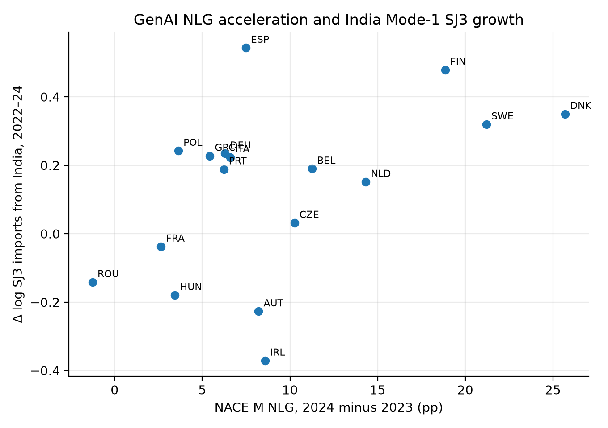

# 生成式 AI 冲击下，土木工程行业经济如何变动？一项聚焦型跨国研究

柴宇轩 · 斯特拉斯克莱德大学 · `yuxuanchai98@outlook.com`  
精简稿 · 2026 年 9 月 17 日

## 摘要

本文研究生成式 AI 采用是否改变本国及跨境的土木工程行业经济。为控制篇幅，正文只讨论三个具有不同识别作用的案例：英国用于观察土木职业调整，印度用于观察模式一跨境服务，中国用于提供模式三建筑服务对照。欧盟 17 国仍作为估计样本，以提供 AI 采用强度与 M71 行业结果的跨国差异，但不逐国展开。

本文的首选冲击是 Eurostat 专业服务业（NACE M）自然语言生成 AI 使用率 `E_AI_TNLG` 在 2023—2024 年的变化，而非笼统的“任何 AI”。本国行业结果来自 NACE M71 建筑与工程活动，区别于工地施工（NACE F）；跨境结果来自 OECD–WTO BaTIS 的 SJ3 技术及其他商业服务；英国 ONS APS 提供职业背景。

主要发现有三点。第一，英国土木职业并非整体收缩：2021 年 12 月至 2025 年 9 月，CAD/绘图技术员减少 23.9%，土木工程师减少 14.3%，建筑与土木工程技术员增加 214.5%。第二，欧盟样本中，Post-2024×ΔTNLG 对 M71 营业额的估计为 −0.007（标准误 0.003），对工资为 −0.009（0.003），而就业不变。第三，印度模式一 SJ3 的相应系数为 0.021（0.008）；笼统 TANY 没有显著关系，中国模式三建筑服务也未向高 NLG 进口国重新配置。生成式 AI 因而与任务极化和印度相关的跨境服务边际同时出现，而不是与国内 M71 繁荣同时出现。这些是面板关联，不能解释为英国土木工程师就业导致外国 GDP 或就业变化。

**关键词：** 生成式 AI；土木工程；NACE M71；服务贸易；印度；英国。

## 1. 研究问题与国家选择

土木工程同时包含可数字化的办公室任务和必须在现场完成的交付。图纸、规范、计算与报告可以远程传输；现场检查、法定责任和实体施工通常不能。因此，“土木工程师”、工程咨询企业和施工承包商不是同一经济对象。

本文的问题是：**企业采用自然语言生成 AI 后，本国工程咨询行业和跨境工程相关服务如何变化？** 为避免国家罗列，正文只保留三种机制：

1. **英国：** 观察土木职业内部是否出现任务极化；
2. **印度：** 检验可远程交付的模式一技术服务；
3. **中国：** 作为依赖项目和商业存在的模式三建筑服务对照。

欧盟 17 国只承担统计识别作用。它们提供 NLG 采用强度与 M71 结果的差异，但不是 17 个独立案例。

## 2. 理论预期

任务理论指出，技术替代的是部分任务，而非必然消灭整个职业（Autor, Levy and Murnane 2003；Autor 2015）。生成式 AI 实验在写作、编程和客服中发现生产率提高，但同一职业内部存在“锯齿状前沿”（Noy and Zhang 2023；Dell’Acqua 等 2023）。对土木工程而言，绘图和规范起草更可编码，专业签章、协调和现场责任更难替代。

任务贸易理论进一步预测，可沿数字网络传输的活动更容易跨境（Grossman and Rossi-Hansberg 2008；Baldwin 2019）。这使印度模式一服务成为主要跨境案例，而中国建筑服务适合作为物理项目交付的对照。

## 3. 数据与方法

### 3.1 英国职业

职业暴露采用 Eloundou 等的 O*NET 数据。人类评分中，建筑与土木绘图员为 0.520，土木工程技术员为 0.477，土木工程师为 0.375。就业来自 ONS APS，对比 2021 年 12 月与 2025 年 9 月。APS 只用于描述，不能用于跨国因果推断。

### 3.2 NLG 冲击与 M71 行业

冲击定义为：

\[
\Delta TNLG_i=TNLG^{M}_{i,2024}-TNLG^{M}_{i,2023}.
\]

`E_AI_TNLG` 是使用 AI 生成书面或口头语言的企业比例。Eurostat 未发布 M71 专属 AI 使用率，因此 NACE M 是最窄的可用代理。欧盟 27 国专业服务业 NLG 从 2023 年的 4.55% 上升至 2024 年的 11.51% 和 2025 年的 17.74%；建筑业同期只有 0.58%、2.42% 和 3.25%。

行业结果来自 Eurostat SBS 的 M71 营业额、工资、就业和增加值（2021—2024）。平衡样本包含 17 个成员国、68 个国家—年份观测。所有单元格均为真实官方数据，没有插值。

### 3.3 印度模式一与中国模式三

跨境数据来自 OECD–WTO BaTIS。SJ3 是本次提取中最细且持续可得的工程相邻服务类别，但它比建筑与工程服务更宽，因为双边 SJ312 不可得。因此，印度 SJ3 是模式一工程相关服务的上限代理，不是土木工程发票的精确总额。

中国 SE 建筑服务用于模式三导向的对照；SI 计算机服务用于检验结果是否只是所有数字服务共同上升。

### 3.4 估计

M71 模型为：

\[
\log Y_{it}=\alpha_i+\lambda_t+\beta(\Delta TNLG_i\times \mathbf{1}[t=2024])+\varepsilon_{it}.
\]

模型包含国家和年份固定效应，标准误按国家聚类。贸易模型同样使用进口国和年份固定效应。由于 SBS 只有一个完整冲击后年份且只有 17 个聚类，结果应解释为差异关联，而非结构性生产率或强因果效应。

## 4. 结果

### 4.1 英国：职业内部极化

CAD、绘图和建筑技术员（SOC 3120）从 72,900 人降至 55,500 人（−23.9%）；土木工程师（2121）从 115,800 人降至 99,200 人（−14.3%）；建筑与土木工程技术员（3114）从 5,500 人升至 17,300 人（+214.5%）。

这一结果不支持“土木职业整体消失”。3114 的 Eloundou 暴露度较高却大幅增长，说明暴露反映任务变化位置，不能机械预测就业人数。

### 4.2 欧盟样本：M71 没有繁荣

Post-2024×ΔTNLG 对 M71 营业额为 −0.007（标准误 0.003），工资为 −0.009（0.003），增加值为 −0.006（0.002），就业为 −0.000（0.002）。高 NLG 国家在 2024 年的名义营业额与劳动成本增长较慢，但就业没有下降。

这种组合可能与计费小时压缩、价格、生产率或需求构成有关，但现有数据不能区分机制。建筑业营业额也为负，说明结果可能部分反映与 NLG 相关的更广泛国家条件，而非 M71 独有冲击。

### 4.3 印度与中国

模式一 SJ3 汇总样本中的 Post-2024×ΔTNLG 为 0.007（0.003）；只保留印度时为 0.021（0.008）。英国从印度进口 SJ3 从 2019 年的 21.85 亿美元升至 2024 年的 49.79 亿美元，增幅 128%。

对照结果缩小了解释范围。笼统的任何 AI（TANY）为 0.000（0.006），计算机服务 SI 为 −0.002（0.006），中国建筑服务 SE 为 −0.008（0.009）。与 NLG 同向变化的是印度相关远程技术服务，不是中国实体项目交付。

这并不表明英国 SOC 2121 的减少变成了印度土木工程师的增加。SJ3 包含非工程服务，而且不存在双边 ISCO 2142 就业序列。

## 5. 讨论与局限

三个案例承担不同功能：英国回答土木职业内部发生了什么，印度检验数字化模式一边际，中国区分远程专业服务与物理项目交付。欧盟成员国用于估计，不需要逐国叙述。这样既保持跨国识别，又避免在有限篇幅内堆积国家背景。

综合证据更接近“任务重组与跨境服务重组”，而不是国内工程咨询繁荣或整个职业被替代。稳定就业与较弱营业额、工资并存，可能来自生产率、计费压缩、需求或宏观差异；本文无法选择唯一机制。

限制包括：没有 M71 专属 NLG 数据；SJ3 宽于工程服务且 SJ312 不可得；SBS 只有一个完整冲击后年份；结果为名义值；APS 不能与企业贸易逐一连接。因此，本文不识别伙伴国 GDP、双边土木工程师就业或福利效应。

## 6. 结论

在可用数据中，生成式 AI 没有伴随国内土木工程咨询业繁荣。英国土木职业出现极化；欧盟样本中，高 NLG 采用与较慢的 M71 营业额和工资增长相关，就业保持稳定；跨境正向关系出现在印度模式一 SJ3，而非中国建筑服务或笼统的任何 AI。

精简后的答案是：**国内 M71 未扩张，印度相关远程服务随 NLG 冲击增加。** 这是行业与贸易边际的证据，不是英国土木工程师就业导致外国经济结果的证据。

## 核心图

**图 1. 英国土木相关职业就业变化。**

**图 2. 欧盟专业服务业 NLG、其他 AI 与建筑业 NLG。**

**图 3. 进口国 ΔTNLG 与印度 SJ3 变化。**

**图 4. M71 与建筑业营业额增长。**

**图 5. 进口国 ΔTNLG 与 M71 营业额变化。**

## 核心表

### 表 1. 英国职业暴露与就业变化

| SOC 2020 | 职业 | Eloundou | APS 变化 |
|---|---|---:|---:|
| 3120 | CAD、绘图与建筑技术员 | 0.520 | −23.9% |
| 2121 | 土木工程师 | 0.375 | −14.3% |
| 3114 | 建筑与土木工程技术员 | 0.477 | +214.5% |

### 表 2. M71 行业结果

| 结果 | Post-2024×ΔTNLG（标准误） | N |
|---|---:|---:|
| M71 营业额 | −0.007**（0.003） | 68 |
| M71 就业 | −0.000（0.002） | 68 |
| M71 工资 | −0.009***（0.003） | 68 |
| M71 增加值 | −0.006***（0.002） | 68 |

### 表 3. 跨境服务结果

| 设定 | 系数（标准误） | N |
|---|---:|---:|
| 模式一 SJ3 汇总 | 0.007**（0.003） | 357 |
| 印度 SJ3 | 0.021***（0.008） | 119 |
| 笼统 TANY | 0.000（0.006） | 336 |
| 计算机服务 SI | −0.002（0.006） | 357 |
| 中国建筑服务 SE | −0.008（0.009） | 119 |

参考文献与英文精简稿一致。
