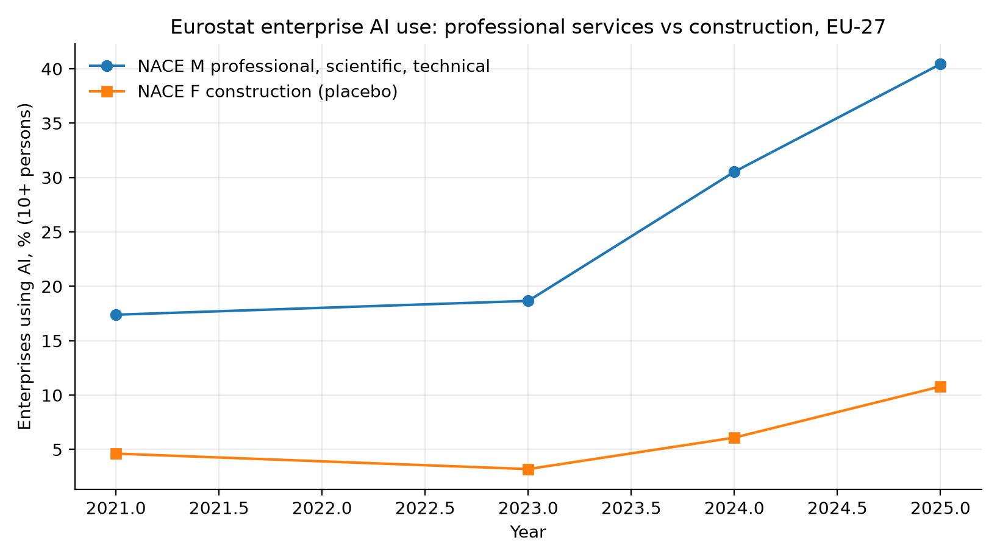
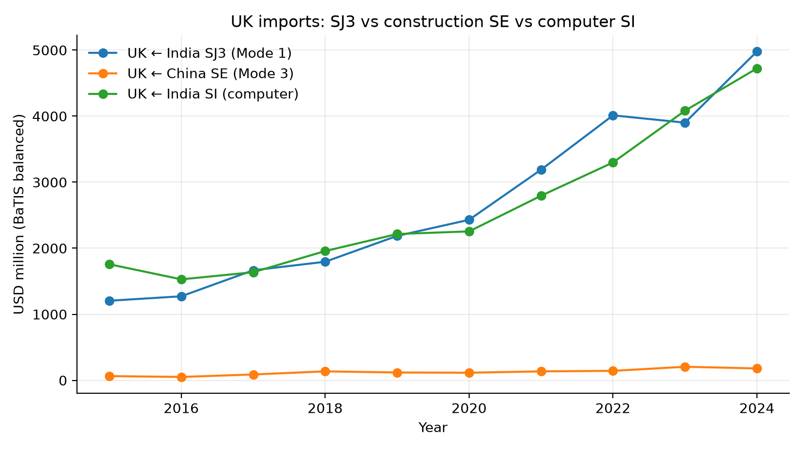
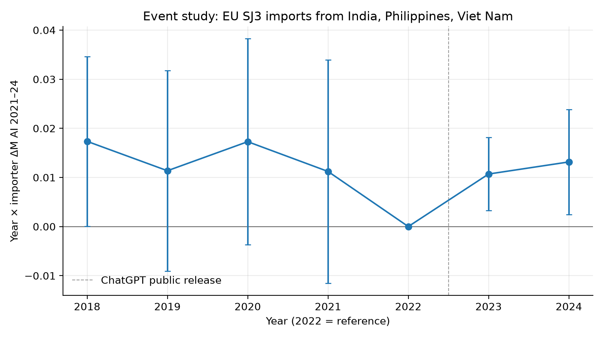
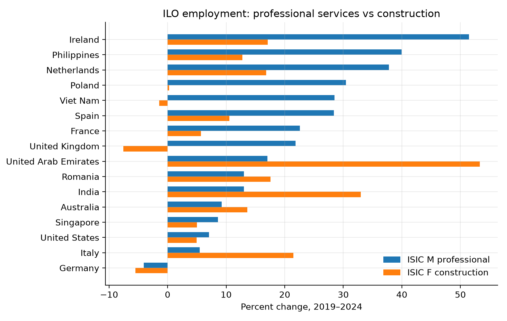
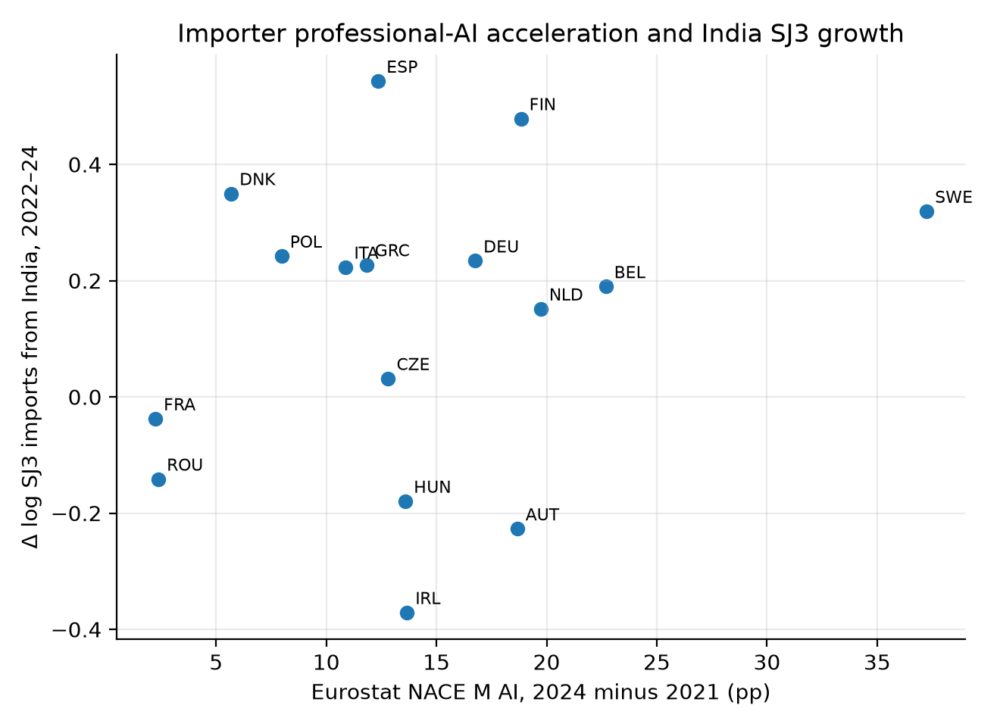
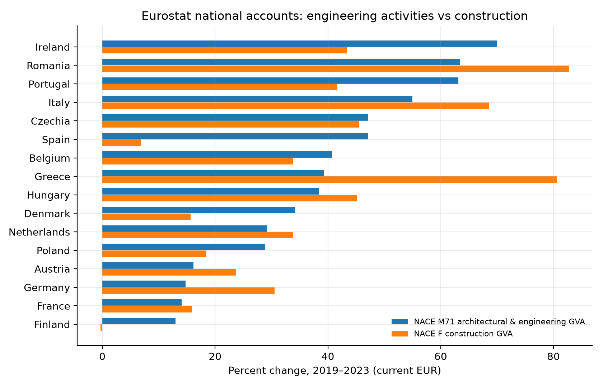
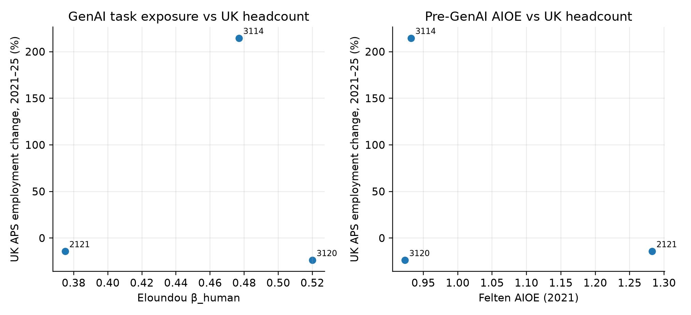
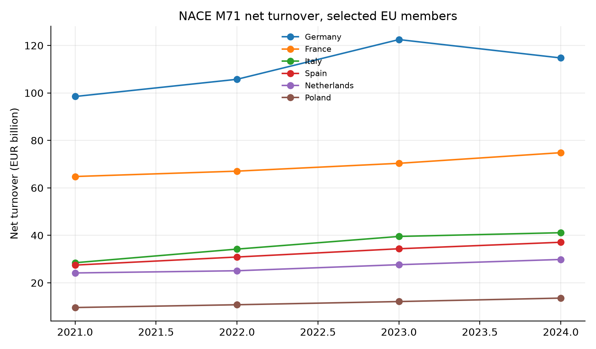

# Supplementary figures 1–23

From: *How Does the Civil Engineering Industry Economy Change under an AI Shock? The United Kingdom’s Service Links with India and China*

## Figure 1

Eurostat enterprise AI use, EU-27, NACE M vs F.

## Figure 2

UK APS employment change, civil-adjacent SOC 2020.

## Figure 3

UK BaTIS: India SJ3, China SE, India SI.

## Figure 4

Event study, year × ΔM TANY.

## Figure 5

ILO ISIC M vs F employment growth.

## Figure 6

EU SJ3 imports vs Chinese construction services.

## Figure 7

ΔM TANY vs Δ log India SJ3.

## Figure 8

Leave-one-importer-out, TANY.

## Figure 9

NACE M71 vs F GVA.

## Figure 10

APS vs Eloundou and Felten AIOE.

## Figure 11

Felten AIIE, US construction.

## Figure 12

EU-27 NLG vs ML vs construction NLG.

## Figure 13

2024 NLG, NACE M vs F.

## Figure 14

Event study, year × ΔM TNLG.

## Figure 15

ΔTNLG vs Δ log India SJ3.

## Figure 16

EU-27 NLG by NACE.

## Figure 17

SBS turnover growth, M71 vs F.

## Figure 18

SBS employment growth, M71 vs F.

## Figure 19

ΔTNLG vs M71 turnover change.

## Figure 20

M71 turnover levels.

## Figure 21

US CES NAICS 54 (too broad).

## Figure 22

UK–India and UK–China SJ3 corridors, 2019 = 100.

## Figure 23

UK–India and UK–China service growth by category.

