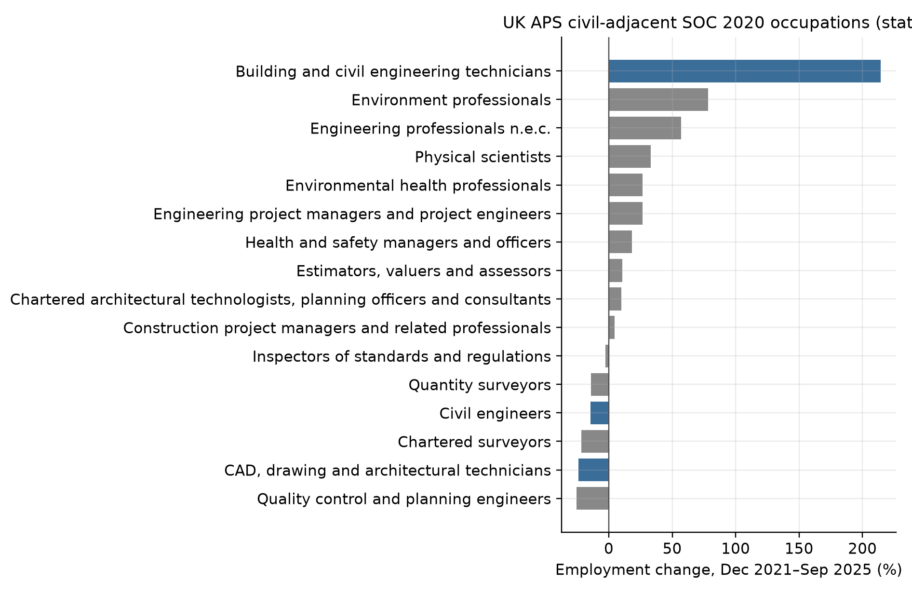
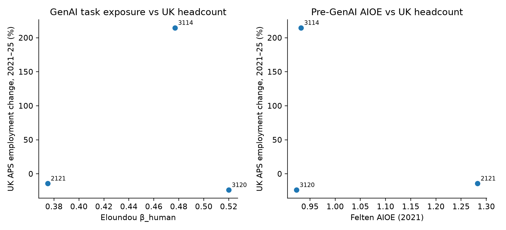
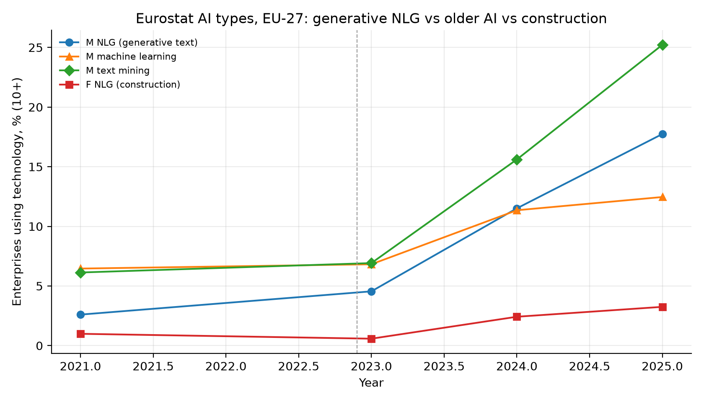
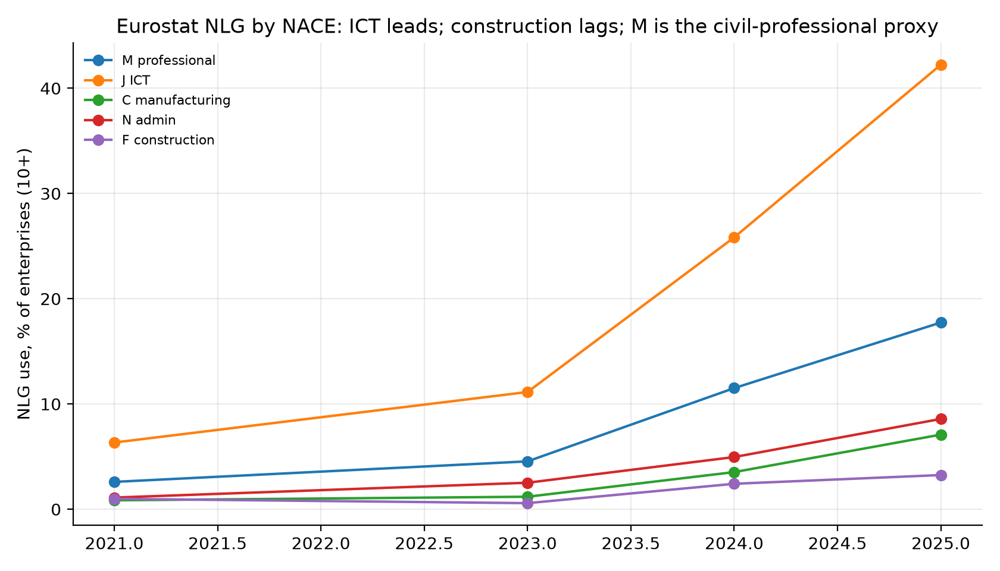
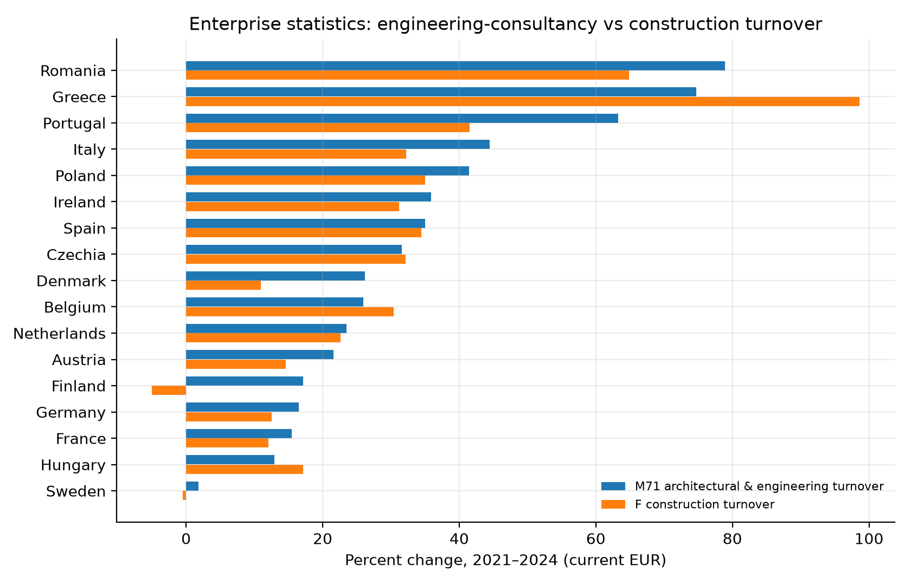

# Main-text figures

AI exposure and the cross-country M71 / Mode-1 industry economy.

## Figure 1

UK APS polarisation (exposure).

## Figure 2

Eloundou vs Felten vs APS.

## Figure 3

NLG vs machine learning vs construction NLG.

## Figure 4

2024 NLG, NACE M vs F.

## Figure 5

NLG by NACE.

## Figure 6

TNLG vs India SJ3 (Mode 1).

## Figure 7

M71 vs F turnover growth.

## Figure 8

TNLG vs M71 turnover.

