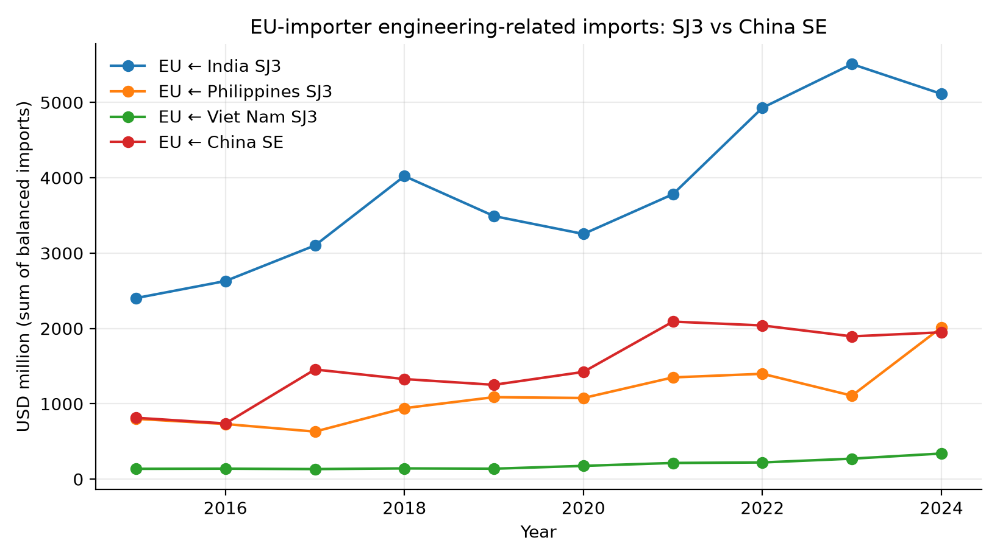
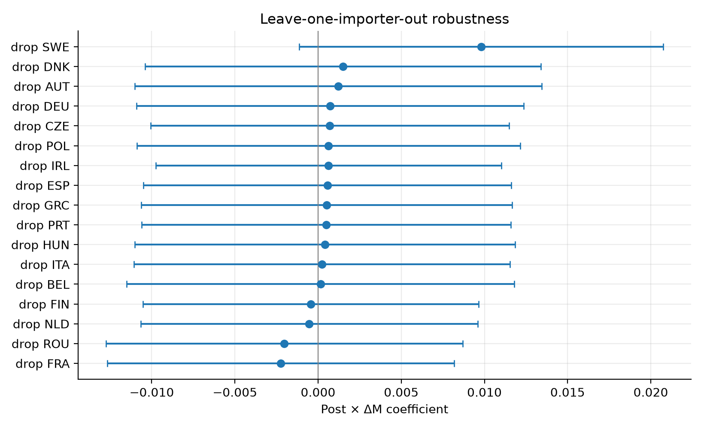
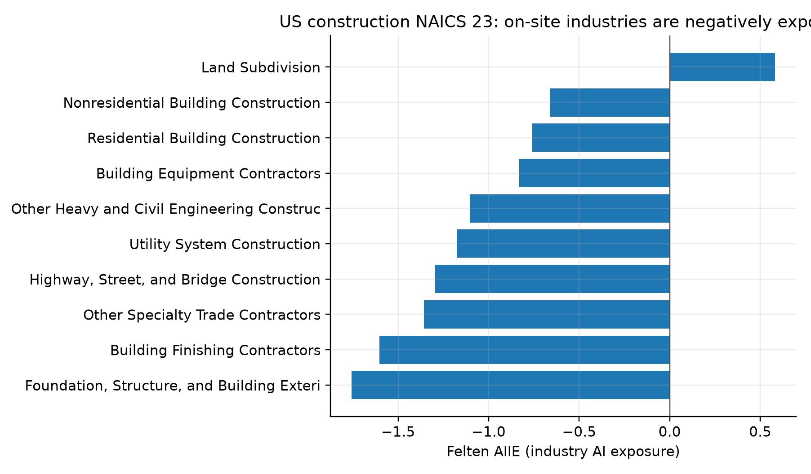
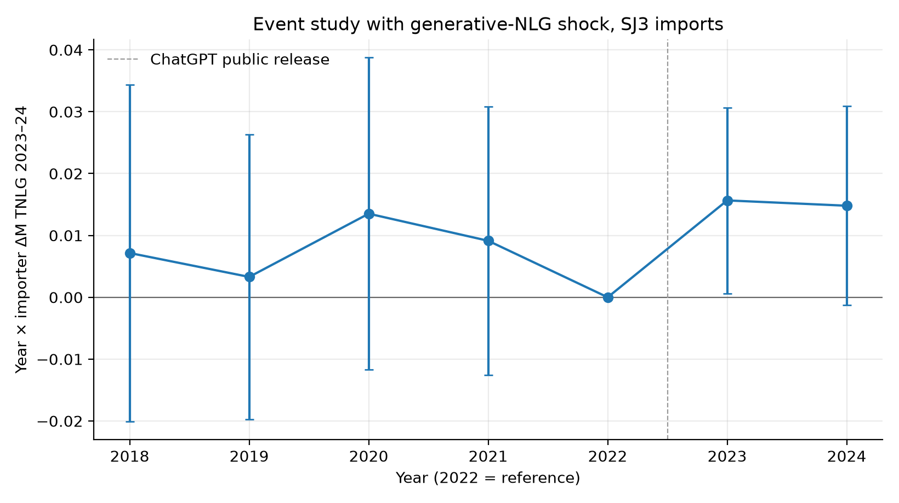
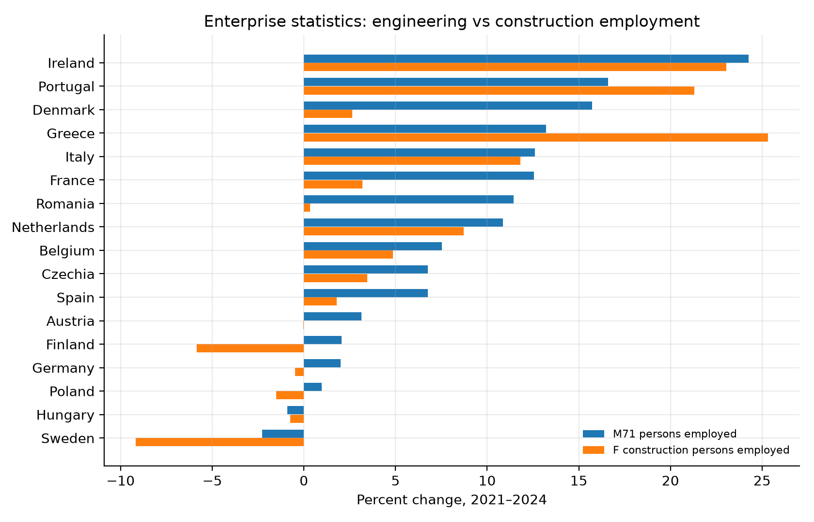
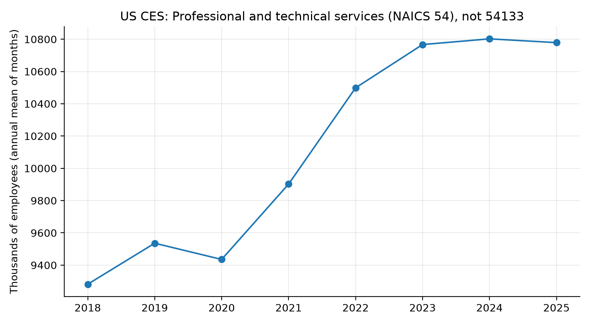

# Figures 1–21 (open this Markdown file — not the zip)

These PNGs sit in `figures/`. Preview this file in the editor to see the charts.

## Figure 1

Eurostat enterprise AI use, EU-27, NACE M vs NACE F, 2021–2025.

## Figure 2

UK APS employment change, 16 civil-adjacent SOC 2020 unit groups, Dec 2021–Sep 2025.

## Figure 3

UK BaTIS balanced imports: India SJ3, China SE, India SI.

## Figure 4

Event study, year × importer ΔM TANY, omit 2022.

## Figure 5

ILO ISIC M vs F employment growth, 2019–2024.

## Figure 6

EU-importer sums: digitally deliverable SJ3 proxy versus Chinese construction services. BaTIS does not directly identify GATS modes of supply.

## Figure 7

Cross-section: ΔM TANY vs Δ log India SJ3, 2022–24.

## Figure 8

Leave-one-importer-out, TANY.

## Figure 9

NACE M71 vs F GVA, 2019–2023, current EUR.

## Figure 10

UK APS change versus Eloundou β_human and versus Felten AIOE.

## Figure 11

Felten AIIE, US construction NAICS 23.

## Figure 12

EU-27 AI types: M NLG vs ML vs text mining vs construction NLG.

## Figure 13

2024 NLG use, NACE M versus F, by country.

## Figure 14

Event study, year × ΔM TNLG 2023–24, omit 2022.

## Figure 15

ΔM TNLG 2023–24 vs Δ log India SJ3, 2022–24.

## Figure 16

EU-27 NLG by NACE M, J, C, N, F.

## Figure 17

SBS net turnover growth 2021–24, M71 vs F.

## Figure 18

SBS employment growth 2021–24, M71 vs F.

## Figure 19

ΔTNLG 2023–24 vs M71 turnover change 2023–24.

## Figure 20

M71 net turnover levels, selected members.

## Figure 21

US CES NAICS 54 only (not engineering 54133).

