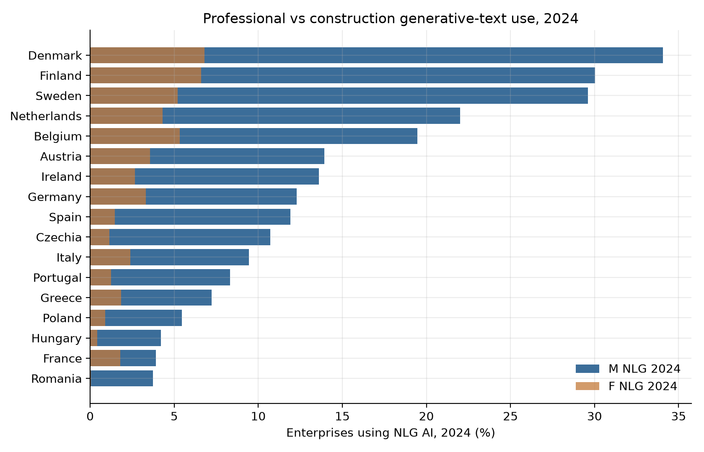
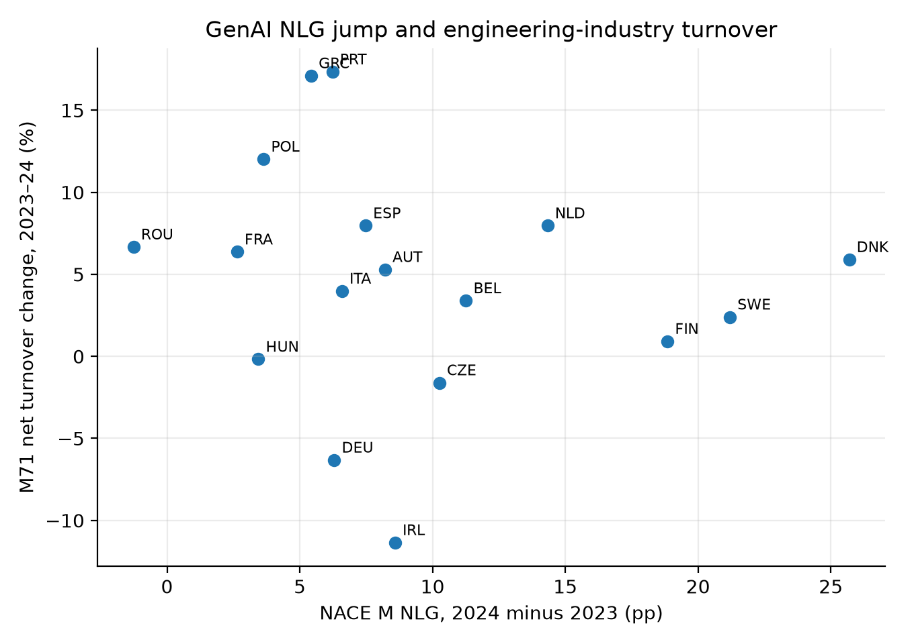

# 已由送审稿取代的工作笔记

IJCM 送审稿为 `Study4_Manuscript.md` 与 `CN_full_article.md`。本短稿不是投递文本。此处 APS 数字仅为补充背景，不能识别伙伴国 GDP。

# 跨国背景下，受 AI 冲击的土木工程行业经济如何变动

柴宇轩 · 斯特拉斯克莱德大学 · `yuxuanchai98@outlook.com`  
工作论文 · 2026 年 9 月 17 日

正文精简稿：只保留 **AI 暴露** 与 **跨国土木工程行业经济**（NACE M71、模式一 SJ3）。不是 IJCM 大模型职业打分。英国 2121 **不能**识别伙伴国 GDP。

## 摘要

土木职业内部暴露是极化的：Eloundou 绘图员 0.52、技术员 0.477、土木工程师 0.375。英国 APS：CAD（3120）−23.9%，2121 −14.3%，3114 +214.5%。

行业并未随 NLG 扩张。欧盟专业服务业 NLG 2023 年 4.55% → 2024 年 11.51%；工地低得多。17 国 SBS：M71 营业额 Post-2024×ΔTNLG **−0.007\*\***，工资 **−0.009\*\*\***，就业 **0.000**。跨境动的是印度模式一 SJ3（**0.021\*\*\***），不是中国模式三，也不是笼统 TANY（**0.000**）。

## 正文图

**图 1.** 英国 APS 土木相邻职业变动（暴露极化）。

**图 2.** APS 变动对 Eloundou 与 Felten AIOE。

**图 3.** 欧盟 NLG 对机器学习、工地 NLG。

**图 4.** 2024 年专业服务与建筑业 NLG。

**图 5.** 分 NACE 的 NLG。

**图 6.** ΔTNLG 与印度 SJ3（模式一）。

**图 7.** M71 与工地营业额增长。

**图 8.** ΔTNLG 与 M71 营业额变动。

