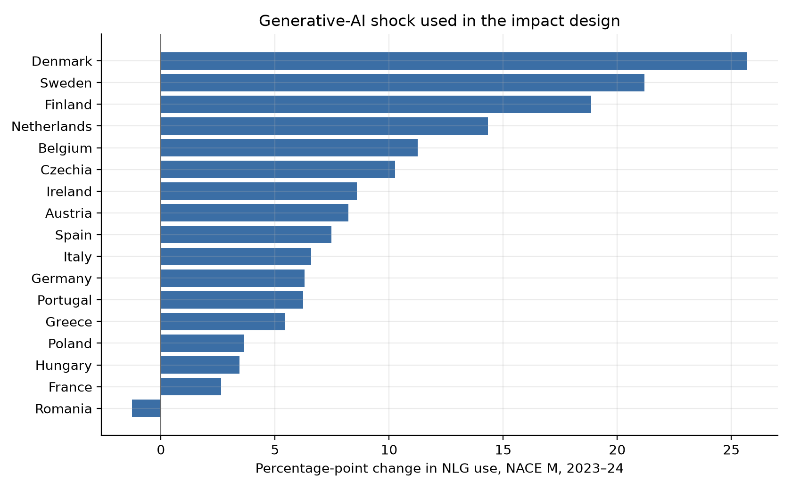
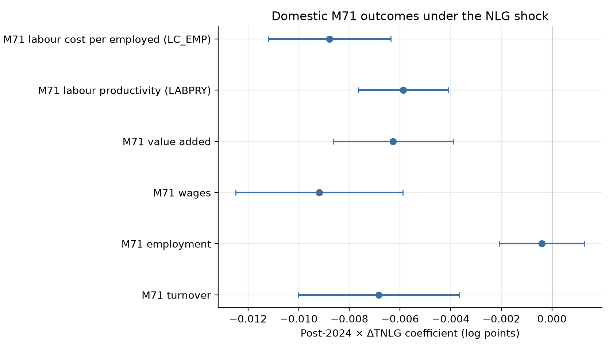
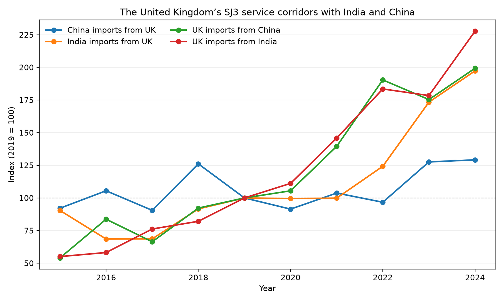
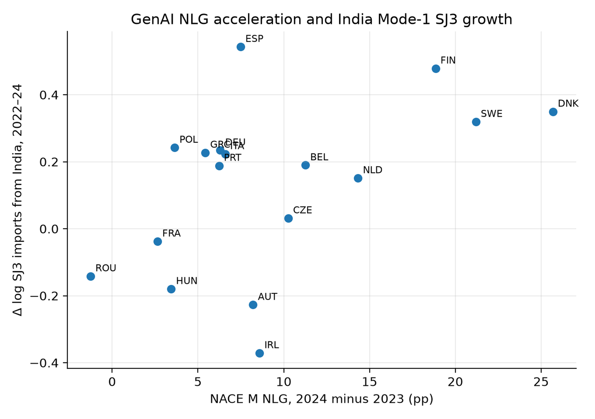
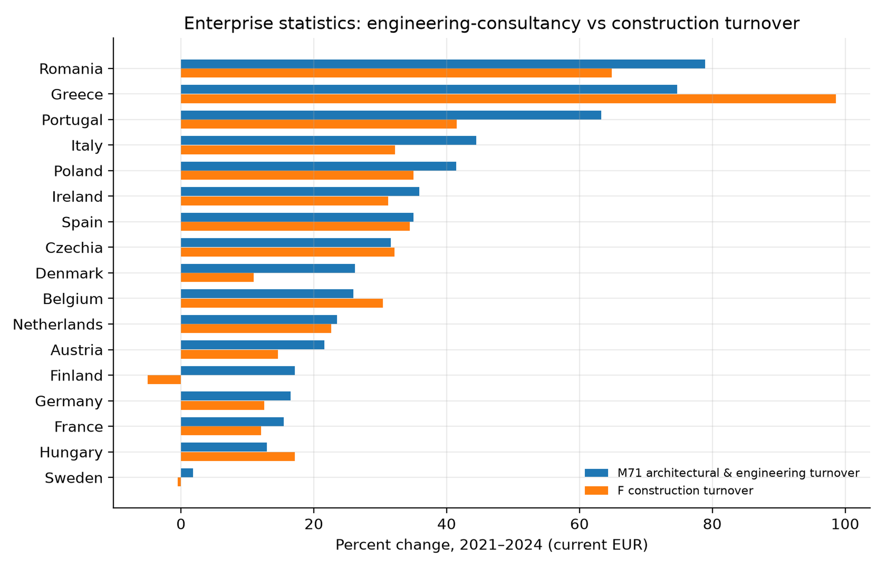
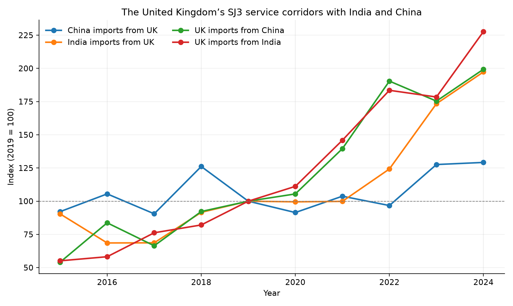

# How Does the Civil Engineering Industry Economy Change under an AI Shock? Industry Accounts and Digitally Deliverable Trade

Yuxuan Chai

University of Strathclyde, Glasgow, United Kingdom

Correspondence: Yuxuan Chai, University of Strathclyde, Glasgow, United Kingdom. Email: yuxuanchai98@outlook.com

Manuscript submitted to the *International Journal of Construction Management*.

## Abstract

This paper measures how a realised generative-AI shock is associated with the civil-engineering *industry economy* and with engineering-related services trade. The shock is the 2023–24 change in Eurostat enterprise use of natural-language-generation (NLG) AI among professional-service firms (NACE M). Identification is a 17-member EU panel: domestic outcomes are Structural Business Statistics for architectural and engineering activities (NACE M71 and engineering consultancy M7112); trade outcomes are Eurostat engineering services (SJ312) and OECD–WTO BaTIS technical services (SJ3). UK–India and UK–China corridors are reported as descriptive context because none of those three countries has a comparable NLG series. In the panel, a 1 percentage-point larger NLG jump is associated with 0.7% lower M71 turnover, 0.9% lower wages and 0.6% lower official labour productivity, with employment and professional-service vacancy rates unchanged. The same shock is associated with higher Indian SJ312 imports (0.034, s.e. 0.013) and a rise in Indian relative to Chinese engineering services, not with Chinese construction services or with SJ312 from the United States, United Kingdom, Switzerland, Japan or extra-EU. The pattern is consistent with slower billed output per worker and a supplier-mix shift toward digitally deliverable engineering-adjacent services. It does not show that generative AI moved civil-engineering jobs or GDP between countries.

**Keywords:** generative AI; civil engineering; construction management; NACE M71; services trade; labour productivity

## 1. Introduction

Civil engineering combines information-intensive design with physical delivery. Drawings, specifications, calculations and reports can be produced and transmitted digitally. Site inspection, statutory responsibility and the construction of roads, bridges or water systems remain tied to location. A generative-AI shock may therefore change the industry economy through two observable margins. Inside the firm, language and drawing assistance can reduce the hours billed for a given deliverable. Across borders, the same tools can lower the cost of coordinating technical tasks that do not require a site presence.

The question is not whether ChatGPT exists. It is whether a *measured* jump in enterprise use of natural-language-generation (NLG) AI is associated with architectural-and-engineering industry accounts and with engineering-related trade. Exposure indices (Felten, Raj and Seamans 2021; Eloundou et al. 2024) describe task potential. They do not record adoption. Eurostat’s E_AI_TNLG item records the share of professional-service enterprises that use AI to generate written or spoken language. That share rose from 4.55% in 2023 to 11.51% in 2024 among EU-27 NACE M firms, and the size of the jump differs sharply across members (Figure 1). That cross-sectional variation is the shock used below.

The research question is therefore:

> Among EU economies, is the 2023–24 professional-service NLG jump associated with slower nominal NACE M71 (and M7112) turnover, wages and labour productivity but not falling employment, and with a shift toward Indian engineering services relative to Chinese construction and Chinese engineering services?

UK–India and UK–China service corridors remain informative as a description of how a large client economy’s technical, construction and computer-service links changed during the same calendar period. They are not the identifying sample. The United Kingdom, India and China are outside the Eurostat enterprise-NLG panel, so bilateral percentage changes cannot be assigned this treatment.

Three measurement choices follow. First, the shock is realised NLG use, not generic any-AI and not an occupation score. Second, the domestic industry is NACE M71 architectural and engineering activities, with M7112 engineering consultancy as the tighter cell; NACE F construction is a comparison industry. Third, the preferred trade object is Eurostat SJ312 engineering services, with BaTIS SJ3 as the balanced broader backup and Chinese SE construction services as the project-based comparison.

The contribution is a service-heading-specific impact design for the first observable generative-adoption wave. Task experiments show that language models can speed writing and coding. Industry accounts show whether those gains appear as turnover, employment, wages or official labour productivity. Trade data show whether digitally deliverable engineering-related imports move differently from project-based construction services. Missing series are catalogued rather than filled. Their absence is part of the claim boundary.

---

## 2. Literature review

### 2.1 Tasks, firms and industry outcomes

Autor, Levy and Murnane (2003) shifted empirical work from occupations to tasks. Autor (2015) emphasised that automation may raise the value of complementary non-routine work, while Acemoglu and Restrepo (2018, 2019, 2020) distinguish displacement from the creation of new tasks. Applied to civil engineering, this framework predicts an uneven response. Drafting, document preparation and routine calculation are more amenable to software assistance than site supervision, liability-bearing judgement and statutory sign-off.

Task productivity does not map mechanically into industry growth. If a consultancy completes a drawing package in fewer hours, it may deliver more projects, reduce billed hours, lower prices or change its staffing mix. Turnover can therefore slow even while physical productivity increases. The M71 accounts used below are valuable precisely because they observe the industry outcome rather than inferring it from occupational exposure.

### 2.2 Measuring the generative shock

Felten, Raj and Seamans (2018, 2021), Webb (2020) and Eloundou et al. (2023, 2024) construct prospective measures of occupational exposure. Such measures are useful for describing task content, but they are not observations of adoption. They also predate or blend several generations of technology. A country may have high potential exposure while few firms use generative tools, and a broad AI measure may rise because of systems unrelated to language production.

The preferred treatment is consequently a realised-adoption measure. Eurostat asks enterprises whether they use AI to generate written or spoken language. The 2023–24 change captures the period in which generative tools diffused rapidly through professional services and overlaps the final year of BaTIS and Structural Business Statistics. It remains imperfect because the survey reports NACE M rather than M71, but it is more closely aligned with the technology and timing of interest than a static occupation score or a consumer-user share.

### 2.3 Generative AI as a labour-market shock

The 2022–23 arrival of ChatGPT created a dated shock that earlier AI indices lack. Noy and Zhang (2023) find large productivity gains in professional writing. Peng, Kalliamvakou, Cihon and Demirer (2023) and related software studies find faster coding with Copilot. Brynjolfsson, Li and Raymond (2025) document customer-support productivity gains concentrated among less experienced workers. Dell’Acqua et al. (2023) describe a “jagged frontier”: AI helps some knowledge tasks and fails on others inside the same job. Hui, Reshef and Zhou (2024) study freelance coding after Copilot.

Two lessons matter for civil engineering. First, text and drawing tasks (specifications, CAD annotation, quantity take-off assistance) sit on the helped side of the jagged frontier; stamp, liability and site work sit on the other. Second, firm experiments are not industry accounts. A draughtsperson who finishes a drawing faster may reduce billed hours without reducing headcount, which is consistent with the SBS pattern in Section 5.5: wages and turnover grow more slowly where NLG jumped while employment does not.

Agrawal, Gans and Goldfarb (2018, 2022) frame AI as cheaper prediction. Korinek and Stiglitz (2021) warn that the distribution of gains depends on whether AI automates or augments. This paper does not estimate welfare. It asks which *measured* industry aggregates moved.

### 2.4 Tradable tasks and the UK’s partner relationships

Blinder (2006) argued that whatever can be delivered down a wire is potentially offshorable. Grossman and Rossi-Hansberg (2008) model trade in *tasks*. Baldwin (2016, 2019) emphasises globotics: digital technology unbundles the professional service from the office. GATS (WTO 1994) still classifies supply as Mode 1 (cross-border), Mode 2 (consumption abroad), Mode 3 (commercial presence) and Mode 4 (presence of natural persons). Francois and Hoekman (2010) and Loungani, Mishra, Papageorgiou and Wang (2017) review why services trade data lag goods data.

For civil engineering, the delivery margin is substantive rather than administrative. Drawings and calculations can be delivered from India without the supplier establishing a local office. Construction work supplied by Chinese firms is more likely to require a project presence, equipment, subcontractors and coordination on site. OECD–WTO BaTIS balanced statistics (Fortanier et al. 2017) provide bilateral EBOPS headings that allow these service categories to be compared, but they do not directly identify GATS modes of supply. SJ3 is therefore used as a proxy for potentially digitally deliverable cross-border work, not as a measured Mode-1 flow; SE is a project-based comparison, not a measured Mode-3 flow. The finest consistently available professional category is SJ3, technical, trade-related and other business services. Bilateral SJ312 architectural and engineering services are unavailable, so Indian SJ3 should be treated as a broad upper bound rather than a count of civil-engineering invoices.

Computer services (SI) are the natural digital comparison: if the panel result merely reflects all remote professional work, SI should move with TNLG; it does not (Table 3). Consulting (SJ2) and R&D (SJ1) provide additional checks in the supplementary tables.

### 2.5 Construction economics versus professional engineering

Construction economics has long treated the contractor industry as project-based, local and weakly digitised (Gann and Salter 2000; Winch 2010). Building information modelling (Eastman, Teicholz, Sacks and Liston 2011; Sacks, Eastman, Lee and Teicholz 2018) digitises *design and coordination*, which live in NACE M71 and related consultancies, not necessarily in NACE F. Whyte (2019) similarly locates digital delivery in professional organisations rather than only on the construction site.

Eurostat (2024) confirms the split. Professional-service enterprises adopted natural-language-generation tools much more rapidly than construction enterprises (Table 2, Figure 3). Felten et al. (2021) also report low industry AI-exposure scores for highway and heavy-civil contractors. On-site construction is therefore a comparison industry rather than the treated professional industry.

### 2.6 The empirical gap

Most research on AI and construction examines an occupation, a technology demonstration or a single project. Macro studies of AI and growth do not isolate engineering consultancies, while vacancy studies do not observe bilateral services delivery. Few studies ask whether a realised generative-adoption shock is associated simultaneously with M71 industry accounts and with different modes of engineering-related trade. The UK relationships with India and China address that gap without suggesting that the partners are otherwise comparable. Their role is to represent different service and delivery margins.

### 2.7 Why the two UK relationships are informative

The UK–India and UK–China relationships differ in ways that make a focused comparison useful. The UK–India relationship is strongly asymmetric in SJ3: the UK purchases far more from India than India purchases from the UK. This resembles a client economy sourcing remotely deliverable business services from India. The reverse flow is nevertheless sizeable and growing, which rules out a one-way account of trade. British firms also supply technical and professional inputs to Indian clients, even though BaTIS cannot identify the civil-engineering component separately.

The UK–China relationship has a different composition. UK imports of Chinese SJ3 almost doubled, but from a much smaller 2019 base than Indian SJ3. Chinese imports of UK SJ3 grew more slowly. Chinese construction services sold to the UK were larger than Indian construction services, while computer services remained important in the reverse direction. Reporting the three headings side by side prevents a rise in “services trade” from being mistaken for a civil-engineering response.

Neither pair is a natural experiment. Their institutions, languages, market sizes, trade policies and business cycles differ, and BaTIS values are balanced estimates that combine reported and imputed information. The comparison is used to organise observed evidence, not to claim that China is a control country for the UK. The inferential leverage comes from the EU panel, where the same adoption question and industrial classifications apply across importers.

This division between description and estimation is central to the paper. Bilateral trends answer where trade changed and in which service categories. The panel asks whether the change in importer NLG adoption predicts Indian SJ3 or Chinese construction imports after common importer and year differences are removed. Agreement between the two forms of evidence would strengthen a mechanism; disagreement would show why headline bilateral growth should not be attributed to AI.

---

## 3. Data

The analysis uses retrieved official series only (Eurostat 2024; OECD & WTO n.d.; ILO n.d.). No country, industry or trade cell is interpolated. Retrieval dates and unsuccessful pulls (including OWID ChatGPT files, an empty IMF AI Preparedness response, OECD ICT_BUS, and ILO M71) are documented in the supplementary replication package and are not filled.

### 3.1 Country-pair design

The United Kingdom is the common country in both comparisons. The UK–India pair captures a mature relationship in remotely supplied professional services. The UK–China pair provides a comparison in which technical, computer and construction services are also observed in both directions. Using the same BaTIS definitions and years avoids comparing unlike national sources.

The pair analysis does not assign an AI treatment to the UK, India or China. The UK is outside the harmonised Eurostat series used here, and consumer adoption measures are not equivalent to enterprise NLG use. Bilateral values are therefore reported as trends. The EU panel remains the inferential component because it supplies a common NLG measure across importers.

### 3.2 AI shock

Eurostat `isoc_eb_ain2`, enterprises with 10+ persons, percent using AI (Eurostat 2024):

- E_AI_TANY, NACE F and M: generic comparison (`eurostat_ai_raw.csv`).
- E_AI_TNLG, TML, TTM, TIR, TPVSG, NACE F and M: generative and technology placebos (`eurostat_ai_genai_types.csv`). TPVSG (pictures/video/sound) exists for **2025 only**.
- Same indicators, NACE C, J, N: sector placebos (`eurostat_ai_nace_placebos.csv`). NACE K (finance) is empty. **NACE M71 is not in the survey** (HTTP 400). NACE M is the finest cell that contains M71 firms.

**Preferred shock:** ΔTNLG in NACE M, 2024 minus 2023. EU-27 M: 2.60 (2021), 4.55 (2023), 11.51 (2024), 17.74 (2025). Construction: 0.99, 0.58, 2.42, 3.25. Size-class TNLG other than GE10 is unpublished.

### 3.3 Civil industry economy

- National accounts `nama_10_a64` / `_e`: GVA, employment, compensation (D1), output (P1) for M71, F, M. UK M71 GVA/D1 stop in **2018**. Thousand hours worked (THS_HW) for M71 are **empty** and are not filled.
- Structural business statistics `sbs_ovw_act` and `sbs_sc_ovw`: M71 vs F vs M, 2021–**2024**, net turnover, persons employed, wages, value added, GOS, **labour productivity** and **labour cost per employed**.
- NACE **M7112** engineering consultancy and **M7111** architecture, 2021–2024.
- Job-vacancy rates `jvs_a_rate_r2` for NACE M and F (not M71), 2018–2025.
- Short-term M71 turnover index `sts_setu_a` (2021=100).
- ILOSTAT employment by sex and economic activity for ISIC F versus M (ILO n.d.). China is empty in this pull. ISIC M71 is not published (404).

Values are **current prices** where applicable. Nominal growth is not a GenAI effect; the DiD asks whether high-NLG countries grew *faster*.

### 3.4 Trade outcomes

Panel: Eurostat ITS SJ312 (engineering) by EU reporter × India / China-except-Hong-Kong, 2018–2024, unpublished years dropped. Backup: OECD–WTO BaTIS SJ3 and SE, adjustment B. Placebos: SI; SJ312 from US, UK, CH, JP and extra-EU.

Illustration only: UK–India and UK–China BaTIS SJ3/SE/SI, both directions, 2015–2024. These three countries have no enterprise-NLG treatment.

### 3.5 Comparability and data quality

BaTIS is chosen because it reconciles exporter and importer reports into a balanced bilateral series. This improves comparability when one side records a service differently or reports with a lag, but the balanced extract used here is fully imputed by the producing agencies: every Table 1 cell and every SJ3/SE/SI observation in the EU importer panel carries OECD–WTO observation status I. Adjustment B is used for cross-country comparability; reported (status A) series exist under other adjustments but are incomplete. The authors do not interpolate missing cells and do not treat a balanced estimate as a firm invoice.

The three service headings have different interpretive roles. SJ3 is the closest consistently available category to technical and engineering-adjacent work, but it also includes trade-related and other business services. SE is narrower in activity but does not itself reveal whether supply occurred through Mode 1 or Mode 3. SI is deliberately outside civil engineering and shows whether a pattern is common to digital services. No heading should be interpreted as a count of civil engineers or projects.

Currency values are converted at market exchange rates and remain nominal. The bilateral percentage changes can therefore reflect exchange rates, inflation and changing prices as well as quantities. Indexed figures improve visual comparison across corridors of different size, but they do not remove those influences. For that reason, levels and percentage changes are shown together in Table 1.

---

## 4. Empirical design

The identifying sample is 17 EU members with both NLG and M71/trade coverage. The United Kingdom is excluded from this panel because it is not in the Eurostat enterprise-NLG extract used here.

### 4.1 Shock

\[
\Delta TNLG_i
=
TNLG^{NACE\,M}_{i,2024}
-
TNLG^{NACE\,M}_{i,2023}.
\]

The unit is percentage points of enterprises with at least ten persons. Size-class TNLG (10–49, 50–249, 250+) is unpublished in `isoc_eb_ain2`; only GE10 exists. Construction TNLG and generic any-AI are comparison shocks. Hours worked in thousand hours for M71 are unpublished in `nama_10_a64_e` (empty THS_HW cells); they are not filled.

### 4.2 Domestic industry impact

For \(t=2021,\ldots,2024\):

\[
\log Y_{it}
=
\alpha_i+\delta_t
+
\beta\bigl(\mathbf{1}[t\ge 2024]\times\Delta TNLG_i\bigr)
+
u_{it}.
\]

\(Y\) includes net turnover, persons employed, wages, value added, gross operating surplus, Eurostat apparent labour productivity (`LABPRY_TEUR`) and labour cost per person employed (`LC_EMP_TEUR`). The last two are official SBS indicators. Where value added and employment are co-published, \(\log(VA/E)\) is reported as a check. Standard errors are clustered by country after an iterative within transformation. NACE M7112 is the tighter engineering-consultancy industry; M7111 architecture and NACE F construction are comparisons. Job-vacancy rates (`jvs_a_rate_r2`) exist for NACE M and F, not M71. A short-term M71 turnover index (`sts_setu_a`, 2021=100) is used as a volume-style corroboration.

A coefficient \(\beta\) is a semi-elasticity. One extra percentage point of \(\Delta TNLG\) is associated with a \(100\beta\) percent change in \(Y\). Scaling by the EU-17 interquartile range of the shock, \(IQR=5.83\) points, gives \(\beta\times IQR\). That is a size comparison, not a welfare estimate.

### 4.3 Transnational mix

Preferred engineering-trade object: Eurostat ITS SJ312. Backup: BaTIS SJ3 (adjustment B). Project-based comparison: Chinese SE. Mix indices:

\[
Mix^{eng}_{it}
=
\log M^{SJ312,IND}_{it}
-
\log M^{SJ312,CN}_{it},
\qquad
Mix^{task}_{it}
=
\log M^{SJ3,IND}_{it}
-
\log M^{SE,CN}_{it}.
\]

The same TWFE as in 4.2 is applied to \(\log M^{k}_{it}\) and to \(Mix_{it}\) for \(t=2018,\ldots,2024\). Missing ITS years are dropped. Placebos: Indian computer services (SI); SJ312 from the United States, United Kingdom, Switzerland, Japan and extra-EU.

### 4.4 What is not identified

The design does not assign an NLG treatment to the UK, India or China. It does not observe GATS modes, civil-only invoices inside SJ312, or ISCO 2142. Table 6 records the claim boundary. UK–India calendar-break formulas (digitally deliverable intensity, net sourcing, difference-in-growth) remain a descriptive supplement in the replication package; they are not the impact estimator.

---

## 5. Results

### 5.1 The shock (Figure 1, Table 2)

Professional-service NLG use in the EU-27 rose from 4.55% of enterprises in 2023 to 11.51% in 2024 and 17.74% in 2025. Construction remained far lower (0.58%, 2.42%, 3.25%). Among the 17 panel members, the 2023–24 NLG jump has a mean of 9.3 percentage points, a median of 7.5, an interquartile range of 5.83, a minimum of −1.3 (Romania) and a maximum of 25.7 (Denmark) (Figure 1). That dispersion, not the EU-wide mean, identifies the impact specifications.

Generic any-AI is a poorer shock for this industry. In the pooled SJ3 panel the any-AI interaction is 0.000 (0.006). The NLG item has a clearer date and a closer link to written technical work.

### 5.2 Domestic M71 impact (Figure 2, Table 4)

Nominal M71 turnover rose in almost every member between 2021 and 2024. That common recovery includes inflation and should not be attributed to generative AI. The fixed-effects model asks whether outcomes grew differently where the NLG jump was larger.

Log M71 turnover has a Post-2024 × ΔTNLG coefficient of −0.007 (s.e. 0.003, \(N=68\)). The corresponding estimates are −0.009 for wages, −0.006 for value added and −0.000 for employment. Official apparent labour productivity (`LABPRY_TEUR`) is −0.006 (0.002); labour cost per person employed is −0.009 (0.002). A ratio formed only from co-published value-added and employment cells gives the same −0.006 (0.002). Gross operating surplus is indistinguishable from zero.

The combination is the result. Higher-NLG economies did not shed more M71 workers, and professional-service job-vacancy rates are unrelated to the shock (0.002, s.e. 0.006, \(N=118\)). Billed output, wages, value added and measured labour productivity grew more slowly. An interquartile NLG jump is associated with about 3.9% lower turnover and 5.2% lower wages in the first complete post-shock year. A short-term M71 turnover index (2021=100) gives −0.009 (0.005), in the same direction as the current-price SBS series.

NACE M7112 engineering consultancy matches the M71 pattern: employment −0.000 (0.002), output −0.008 (0.003), wages −0.009 (0.004). Architecture (M7111) shows slower wages (−0.015) and turnover (−0.010) with employment still insignificant. Construction turnover is −0.010 (0.003). The domestic association is therefore not unique to engineering consultancies; it is a professional-and-construction slowdown in nominal accounts where NLG jumped, with engineering-consultancy employment remaining flat.

Hours worked in thousand hours for M71 are unpublished. Size-class NLG is unpublished except GE10. Those gaps are logged, not filled.

### 5.3 Transnational mix (Table 3)

Indian engineering-service imports (Eurostat SJ312) have a Post × ΔTNLG coefficient of 0.034 (0.013), \(N=89\). Chinese SJ312 is −0.051 (0.025), \(N=87\). The engineering mix, \(\log M^{IN}-\log M^{CN}\), is 0.095 (0.037), \(N=77\). BaTIS Indian SJ3, the broader balanced backup, is 0.021 (0.008), \(N=119\); Chinese construction services are −0.008 (0.009); the SJ3-versus-SE mix is 0.029 (0.013). Indian computer services are −0.009 (0.005). SJ312 from the United States, United Kingdom, Switzerland, Japan and extra-EU are all insignificant.

One extra percentage point of importer NLG is associated with about 2.1% higher Indian SJ3 imports. The same increment is associated with a large movement in the India/China engineering ratio; that mix estimate has a smaller sample and should be read as an association, not as a 74% IQR “effect.” Architectural SJ311 cells are mostly zero and are not estimated.

The trade pattern is therefore a supplier-mix shift toward Indian engineering-related services, not a generic engineering-import boom and not a reorientation of Chinese construction services toward high-NLG destinations. Chinese construction exports to lower-ΔTNLG EU members rose 65.4% between 2019 and 2024, compared with 47.5% for higher-ΔTNLG members (Table 5).

### 5.4 UK–India and UK–China illustration (Table 1)

The UK is outside the NLG panel. Its corridors are reported so that the panel coefficients are not mistaken for the only facts in the file.

UK imports of Indian SJ3 rose from USD 2.19 billion in 2019 to USD 4.98 billion in 2024 (+127.7%). The reverse flow rose 97.3%. UK imports of Chinese SJ3 rose 99.3% from a smaller base. Construction services remained a few tens of millions of dollars on the India corridor and under USD 180 million from China. Digitally deliverable intensity on UK←India was already 0.981 in 2019 and 0.986 in 2024. India’s share of UK world SJ3 rose from 4.2% to 6.9%. A calendar-break contrast around public ChatGPT does **not** show SJ3 outpacing SE in 2022–24 (\(DiG=-0.95\)); that mix shift is older (2019–22). UK APS occupations polarised descriptively (civil engineers −12.5%, CAD −21.0%, technicians +197%) with no Indian ISCO 2142 counterpart. These are composition facts. They are not an identified AI impact.

---

## 6. Discussion

Task experiments find large productivity gains in writing and coding. The M71 accounts in the first post-shock year do not show a corresponding rise in official labour productivity. Apparent productivity, wages and turnover all grow more slowly where NLG jumped, while employment and vacancy rates do not. That pattern is consistent with assistance that reduces billable hours and labour cost per worker without an immediate change in headcount. It is also consistent with prices, demand composition and national conditions that happen to coincide with adoption. Construction turnover moves in the same direction, so the domestic result should not be sold as engineering-specific damage.

The trade estimates add a second margin. Indian SJ312 and SJ3 rise with importer NLG; Chinese engineering services fall; Chinese construction services and extra-EU engineering services do not rise. Complementary offshoring of digitally deliverable technical tasks is a possible reading (Grossman and Rossi-Hansberg 2008; Baldwin 2019). Substitution of domestic civil engineers is not supported by the employment or vacancy series, and SJ312 is still broader than civil invoices.

Scaling coefficients by the 5.83-point interquartile shock is a way to judge economic size. It is not a counterfactual that moves Denmark’s adoption to Romania’s. The post window is one SBS year and two trade years. Statistical significance is reported without treating it as proof of a mechanism.

---

## 7. Limitations

Eurostat does not publish NLG use for M71, TNLG by enterprise size class, or M71 hours worked. Job-vacancy rates exist for NACE M, not M7112. BaTIS 2024 cells in the preferred extract are OECD–WTO imputed (observation status I). SJ312 is all engineering services. GATS modes and ISCO 2142 are unpublished. The UK, India and China have no enterprise-NLG treatment in this file. Construction accounts share the domestic slowdown. These gaps are not repaired by interpolation.

---

## 8. Conclusion

A realised professional-service NLG shock is associated with slower nominal M71 and M7112 turnover, wages, value added and official labour productivity, with employment and vacancy rates unchanged, and with higher Indian engineering-related imports relative to Chinese construction and Chinese engineering services. UK–India technical services also expanded, but that corridor has no NLG treatment and was already almost entirely SJ3 before 2023. The paper documents an industry-and-trade association during the first generative-adoption wave. It does not claim that generative AI relocated civil-engineering jobs or GDP (Table 6).

---

## Author contribution

Yuxuan Chai is the sole author and was responsible for the study conception, data curation, analysis, visualisation and manuscript preparation.

## Funding

This research received no specific grant from any funding agency in the public, commercial or not-for-profit sectors.

## Ethics statement

The study analyses published aggregate statistical series and does not involve human participants, personal data or animal subjects.

## Disclosure statement

No potential conflict of interest was reported by the author.

## Data availability statement

The findings draw on Eurostat, OECD–WTO BaTIS and ILOSTAT series, which remain subject to their publishers’ terms and should be cited as in the reference list. Supplementary tables and figures reproduce the derived estimates; the full replication package is available from the corresponding author on request. Author-generated files are released under CC BY 4.0.

## References

Acemoglu, D., & Restrepo, P. (2018). The race between man and machine: Implications of technology for growth, factor shares, and employment. *American Economic Review, 108*(6), 1488–1542.

Acemoglu, D., & Restrepo, P. (2019). Automation and new tasks: How technology displaces and reinstates labor. *Journal of Economic Perspectives, 33*(2), 3–30.

Acemoglu, D., & Restrepo, P. (2020). Robots and jobs: Evidence from US labor markets. *Journal of Political Economy, 128*(6), 2188–2244.

Agrawal, A., Gans, J., & Goldfarb, A. (2018). *Prediction machines: The simple economics of artificial intelligence*. Harvard Business Review Press.

Agrawal, A., Gans, J., & Goldfarb, A. (2022). *Power and prediction: The disruptive economics of artificial intelligence*. Harvard Business Review Press.

Autor, D. H. (2015). Why are there still so many jobs? The history and future of workplace automation. *Journal of Economic Perspectives, 29*(3), 3–30.

Autor, D. H., Levy, F., & Murnane, R. J. (2003). The skill content of recent technological change: An empirical exploration. *Quarterly Journal of Economics, 118*(4), 1279–1333.

Baldwin, R. (2016). *The great convergence: Information technology and the new globalization*. Harvard University Press.

Baldwin, R. (2019). *The globotics upheaval: Globalization, robotics, and the future of work*. Oxford University Press.

Blinder, A. S. (2006). Offshoring: The next industrial revolution? *Foreign Affairs, 85*(2), 113–128.

Brynjolfsson, E., Li, D., & Raymond, L. (2025). Generative AI at work. *Quarterly Journal of Economics, 140*(2), 889–942.

Dell’Acqua, F., McFowland, E., Mollick, E., Lifshitz-Assaf, H., Kellogg, K. C., Rajendran, S., Krayer, L., Candelon, F., & Lakhani, K. R. (2023). Navigating the jagged technological frontier: Field experimental evidence of the effects of AI on knowledge worker productivity and quality (Harvard Business School Working Paper 24-013).

Eastman, C., Teicholz, P., Sacks, R., & Liston, K. (2011). *BIM handbook: A guide to building information modeling* (2nd ed.). Wiley.

Eloundou, T., Manning, S., Mishkin, P., & Rock, D. (2023). GPTs are GPTs: An early look at the labor market impact potential of large language models. arXiv:2303.10130.

Eloundou, T., Manning, S., Mishkin, P., & Rock, D. (2024). GPTs are GPTs: Labor market impact potential of LLMs. *Science, 384*(6702), 1306–1308.

Eurostat. (2024). *ICT usage in enterprises: Artificial intelligence (isoc_eb_ain2); national accounts (nama_10_a64, nama_10_a64_e); structural business statistics (sbs_ovw_act, sbs_sc_ovw); international trade in services (bop_its6_det); job vacancy rates (jvs_a_rate_r2); short-term business statistics (sts_setu_a)*. European Commission.

Felten, E., Raj, M., & Seamans, R. (2018). A method to link advances in artificial intelligence to occupational abilities. *AEA Papers and Proceedings, 108*, 54–57.

Felten, E., Raj, M., & Seamans, R. (2021). Occupational, industry, and geographic exposure to artificial intelligence: A novel dataset and its potential uses. *Strategic Management Journal, 42*(12), 2195–2217.

Fortanier, F., Liberatore, A., Maurer, A., & Pilgrim, G. (2017). *The OECD–WTO Balanced Trade in Services database*. OECD/WTO.

Francois, J., & Hoekman, B. (2010). Services trade and policy. *Journal of Economic Literature, 48*(3), 642–692.

Gann, D. M., & Salter, A. J. (2000). Innovation in project-based, service-enhanced firms: The construction of complex products and systems. *Research Policy, 29*(7–8), 955–972.

Grossman, G. M., & Rossi-Hansberg, E. (2008). Trading tasks: A simple theory of offshoring. *American Economic Review, 98*(5), 1978–1997.

Hui, X., Reshef, O., & Zhou, L. (2024). The short-term effects of generative artificial intelligence on employment: Evidence from an online labor market. *Organization Science*.

ILO. (n.d.). *ILOSTAT: Employment by sex and economic activity*. International Labour Organization.

Korinek, A., & Stiglitz, J. E. (2021). Artificial intelligence, globalization, and strategies for economic development (NBER Working Paper 28453).

Loungani, P., Mishra, S., Papageorgiou, C., & Wang, K. (2017). World trade in services: Evidence from a new dataset (IMF Working Paper 17/77).

Noy, S., & Zhang, W. (2023). Experimental evidence on the productivity effects of generative artificial intelligence. *Science, 381*(6654), 187–192.

OECD & WTO. (n.d.). *BaTIS: Balanced Trade in Services dataset* (BPM6, adjustment B).

Peng, S., Kalliamvakou, E., Cihon, P., & Demirer, M. (2023). The impact of AI on developer productivity: Evidence from GitHub Copilot. arXiv:2302.06590.

Sacks, R., Eastman, C., Lee, G., & Teicholz, P. (2018). *BIM handbook: A guide to building information modeling for owners, designers, engineers, contractors, and facility managers* (3rd ed.). Wiley.

Webb, M. (2020). *The impact of artificial intelligence on the labor market*. Stanford University.

Whyte, J. (2019). How digital information transforms project delivery models. *Project Management Journal, 50*(2), 177–194.

Winch, G. M. (2010). *Managing construction projects* (2nd ed.). Wiley-Blackwell.

WTO. (1994). *General Agreement on Trade in Services*. World Trade Organization.

## Tables

**Table 1.** UK–India and UK–China service corridors

| Import flow | Service | 2019 (USD m) | 2024 (USD m) | Change |
|---|---|---|---|---|
| UK imports from India | SJ3 technical and other business services | 2,186.6 | 4,979.3 | 127.7% |
| India imports from UK | SJ3 technical and other business services | 787.6 | 1,554.2 | 97.3% |
| UK imports from China | SJ3 technical and other business services | 775.5 | 1,546.0 | 99.3% |
| China imports from UK | SJ3 technical and other business services | 739.0 | 954.6 | 29.2% |
| UK imports from India | SE construction services | 41.9 | 72.8 | 73.7% |
| India imports from UK | SE construction services | 39.3 | 72.6 | 84.8% |
| UK imports from China | SE construction services | 118.5 | 179.8 | 51.7% |
| China imports from UK | SE construction services | 54.8 | 70.8 | 29.2% |
| UK imports from India | SI computer and information services | 2,215.3 | 4,723.0 | 113.2% |
| India imports from UK | SI computer and information services | 389.2 | 707.6 | 81.8% |
| UK imports from China | SI computer and information services | 724.7 | 1,054.5 | 45.5% |
| China imports from UK | SI computer and information services | 1,639.3 | 2,404.1 | 46.7% |

*Note.* Source: OECD–WTO BaTIS, adjustment B. Values are balanced imports in current USD million.

**Table 2.** EU-27 enterprise use of natural-language-generation AI

| Industry | 2023 | 2024 | 2025 |
|---|---|---|---|
| NACE M professional services | 4.55% | 11.51% | 17.74% |
| NACE F construction | 0.58% | 2.42% | 3.25% |

*Note.* Source: Eurostat isoc_eb_ain2, enterprises with at least ten persons.

**Table 3.** Trade estimates under the NLG shock

| Outcome/specification | Coefficient (s.e.) | N |
|---|---|---|
| Indian SJ312 engineering services | 0.034** (0.013) | 89 |
| Chinese SJ312 engineering services | −0.051** (0.025) | 87 |
| Mix: log(IN SJ312) − log(CN SJ312) | 0.095*** (0.037) | 77 |
| Indian SJ3 (BaTIS B) | 0.021*** (0.008) | 119 |
| Chinese construction services (SE) | −0.008 (0.009) | 119 |
| Mix: log(IN SJ3) − log(CN SE) | 0.029** (0.013) | 119 |
| Indian computer services (SI) | −0.009* (0.005) | 119 |
| Extra-EU SJ312 | 0.003 (0.012) | 115 |
| Generic any-AI, pooled SJ3 | 0.000 (0.006) | 336 |

*Note.* Importer and year fixed effects; standard errors clustered by importer. ITS years with unpublished cells are dropped. US, UK, Swiss and Japanese SJ312 placebos are all insignificant. *p < 0.10, **p < 0.05, ***p < 0.01.

**Table 4.** M71 industry outcomes under the NLG shock

| Outcome | Post-2024 × ΔTNLG (s.e.) | N |
|---|---|---|
| Log M71 turnover | −0.007** (0.003) | 68 |
| Log M71 employment | −0.000 (0.002) | 68 |
| Log M71 wages | −0.009*** (0.003) | 68 |
| Log M71 value added | −0.006*** (0.002) | 68 |
| Log M71 labour productivity (LABPRY) | −0.006*** (0.002) | 68 |
| Log M71 labour cost per employed | −0.009*** (0.002) | 68 |
| Log M7112 engineering-consultancy employment | −0.000 (0.002) | 68 |
| Log M7112 output | −0.008** (0.003) | 68 |
| Log NACE M job-vacancy rate | 0.002 (0.006) | 118 |
| Log M71 STS turnover index | −0.009* (0.005) | 109 |
| Log construction turnover (comparison) | −0.010*** (0.003) | 68 |

*Note.* Country and year fixed effects; standard errors clustered by country. LABPRY and labour cost per employed are Eurostat SBS indicators. M71 hours in thousand hours are unpublished. *p < 0.10, **p < 0.05, ***p < 0.01.

**Table 5.** Chinese construction services by importer NLG group

| EU destination group | 2019 (USD m) | 2024 (USD m) | Change |
|---|---|---|---|
| Lower ΔTNLG | 571.9 | 946.2 | 65.4% |
| Higher ΔTNLG | 679.9 | 1,002.6 | 47.5% |

*Note.* Source: OECD–WTO BaTIS SE. Groups split at the importer-median ΔTNLG in NACE M. Spain equals the median and is assigned to the higher group (9 vs 8 importers). A strict greater-than split yields 54.9% versus 56.5%.

**Table 6.** Interpretation boundary

| Supported by the data | Not identified |
|---|---|
| NLG jump associated with slower M71/M7112 turnover, wages, VA and official labour productivity | M71-specific AI adoption or M71 hours |
| Flat M71/M7112 employment and flat NACE M vacancy rates | Generative AI cutting civil-engineer headcount |
| NLG jump associated with Indian SJ312/SJ3 relative to Chinese SJ312/SE | Civil-only invoices; GATS modes; ISCO 2142 relocation |
| Two-way UK–India and UK–China service trends | AI causing those bilateral changes or partner GDP effects |

*Note.* The table restates the claim boundary; it is not an additional statistical test.

## Figure captions

**Figure 1.** EU-17 professional-service NLG jump, 2023–24 (the impact shock).

**Figure 2.** Domestic M71 outcomes under the NLG shock (Post-2024 × ΔTNLG).

**Figure 3.** The United Kingdom’s SJ3 service corridors with India and China, 2015–2024 (2019 = 100).

**Figure 4.** Importer ΔTNLG and the change in Indian SJ3 imports.

**Figure 5.** M71 and construction turnover growth, 2021–2024.

## Figures

Figures are supplied as separate 300 dpi PNG files and are repeated below for the convenience of reviewers.

**Figure 1.** EU-17 professional-service NLG jump, 2023–24.

**Figure 2.** Domestic M71 outcomes under the NLG shock.

**Figure 3.** The United Kingdom’s SJ3 service corridors with India and China, 2015–2024 (2019 = 100).

**Figure 4.** Importer ΔTNLG and the change in Indian SJ3 imports.

**Figure 5.** M71 and construction turnover growth, 2021–2024.

## Figure captions

**Figure 1.** The United Kingdom’s SJ3 service corridors with India and China, 2015–2024 (2019 = 100).

**Figure 2.** Growth in UK–India and UK–China services trade by category, 2019–2024.

**Figure 3.** EU-27 professional-service NLG adoption and technology comparisons.

**Figure 4.** Importer ΔTNLG and the change in Indian SJ3 imports.

**Figure 5.** M71 and construction turnover growth, 2021–2024.

## Figures

Figures are supplied as separate 300 dpi PNG files (`Figure1.png`–`Figure5.png`) and are repeated below for the convenience of reviewers.

**Figure 1.** The United Kingdom’s SJ3 service corridors with India and China, 2015–2024 (2019 = 100).

**Figure 2.** Growth in UK–India and UK–China services trade by category, 2019–2024.

**Figure 3.** EU-27 professional-service NLG adoption and technology comparisons.

**Figure 4.** Importer ΔTNLG and the change in Indian SJ3 imports.

**Figure 5.** M71 and construction turnover growth, 2021–2024.

